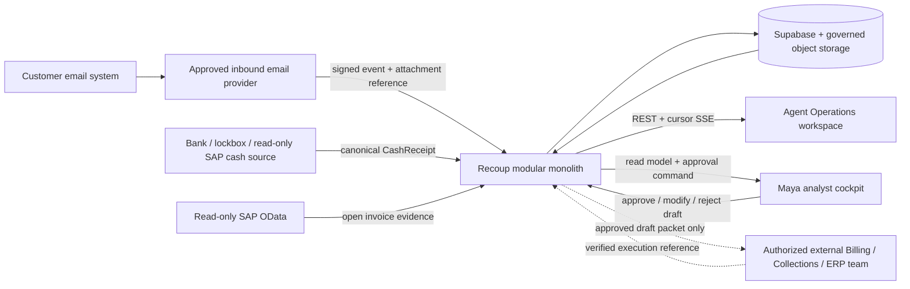
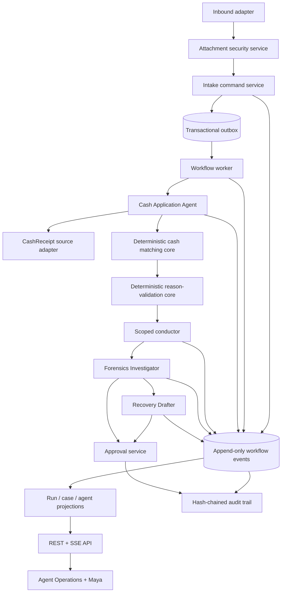
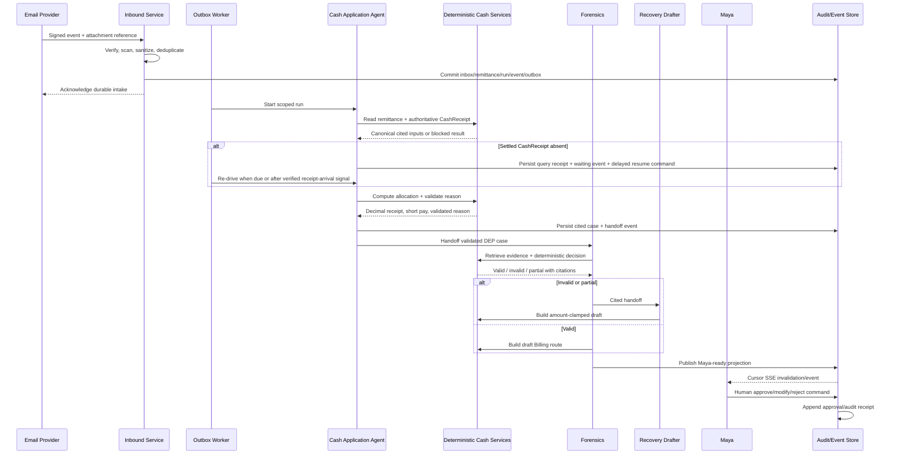

# Recoup v2 SDD Addendum: Remittance Email, Cash Application Agent, and Live Agent Workspace

**Document ID:** RECOUP-SDD-ADD-CASHAPP-001  
**Version:** 0.9.4 (final-review readiness and implementation-entry amendment)  
**Date:** 2026-08-22  
**Repository baseline reviewed:** `origin/main` at `0dfcaa7edcb7c3b6f1d8952fd0f100fa5e018c97`; local authoring checkout remained `main` at `eeca34327b562bbc3101ac5f019d1a4ecd1f2be7`  
**Supersedes:** nothing; this is an additive addendum to the existing Recoup SDD  
**Status:** Final design review candidate; Phase 0-only authorization requested; implementation remains NO-GO  
**Classification:** Internal working specification

## 0. Document authority and use

### 0.1 Purpose

This addendum defines the architecture required to extend Recoup upstream from an already-created deduction into a governed journey that begins with a customer remittance email. It covers secure email intake, verification of settled cash, deterministic cash matching and allocation, creation of a short-payment deduction case, scoped handoff to Deduction Forensics, and assignment to Maya. It also defines the live Agent Operations workspace through which a customer can observe truthful agent states and durable actions in near real time.

The addendum is deliberately architecture-first. It does not claim that the proposed components are already implemented. The accompanying [Technical Design](./2026-08-21-cash-application-agent-workspace-technical-design.md) translates this architecture into module, schema, API, UI, migration, and test work.

### 0.2 Precedence

Conflicts are resolved in this order:

1. `INVARIANTS.md`
2. `RECONCILIATION_LEDGER.md`
3. Approved sections of `Recoup_v2_SDD.md` and `Recoup_Software_Design_Document_v3.0.docx`
4. Owner-approved requirements in `Recoup_Business_Requirements_Document_v3.3.4_Cash_Application_Agent_Workspace.md`, within the bounds of items 1-3
5. This approved addendum
6. The Technical Design derived from this addendum
7. Implementation judgment

The BRD defines the requested business outcome; this addendum resolves its architecture. Neither can weaken I-1 through I-30, alter the S1-S8 gold set, authorize ERP mutation, or introduce an unapproved business constant. A residual BRD/SDD conflict is a stop-and-resolve condition, not permission to choose one silently.

**No ERP write-back is introduced or authorized by this addendum.**

### 0.3 Input documents

- `docs/Recoup_Business_Requirements_Document_v3.3.4_Cash_Application_Agent_Workspace.md`
- `docs/plans/2026-08-19-remittance-email-cash-application-agent-workspace-plan.docx`
- `INVARIANTS.md`
- `RECONCILIATION_LEDGER.md`
- `Recoup_v2_SDD.md`
- `docs/specs/Recoup_Software_Design_Document_v3.0.docx`
- `docs/architecture/maya-agentic-forensics-technical-design.md`
- Current repository types, services, adapters, tests, cockpit routes, and Supabase schema

### 0.4 Baseline finding

The existing solution contains reusable Forensics, Recovery, Maya, approval, audit, source-port, connector, SSE, and Agent Operations foundations. It does not yet contain an approved inbound remittance command, authoritative `CashReceipt`, deterministic cash-allocation core, live `DeductionCase` contract, transactional workflow event/outbox model, or run-scoped Agent Operations state.

The existing `remittance_headers` and `remittance_lines` tables are readiness/source structures with service-role read access. The current remittance adapter reads synthetic evidence. They must not be described as a production inbound cash-application workflow or upgraded into the live write authority for this change. The canonical live authority is the additive `recoup_cash_*` / `recoup_workflow_*` model in AD-CA-01.

### 0.5 Approval and implementation gate

Implementation is **NO-GO** until all of the following are true:

- This addendum is approved by the Product Owner, Cash Application Owner, Architecture Owner, Security Owner, Deduction Policy Owner, and Agent Operations Owner.
- The owner decisions in Section 20 are approved or explicitly deferred with fail-closed behavior.
- D-02, D-04, D-05 and D-08 have successful evidence in the co-located Phase 0 evidence pack. A failed SAP authentication probe does not ratify D-02.
- D-11 and D-13 are approved, and N5 is scheduled as a runtime safety change with construction-gate, pre-claim and zero-mutation tests; documentation alone does not close N5.
- The companion Technical Design is consistent with this addendum.
- The target implementation branch and baseline commit are identified.
- Baseline verification evidence is captured before code or database changes.

### 0.6 Final-review disposition and current evidence

The requested final review is a review of the synchronized specification set and its implementation-entry controls. Approval may authorize completion of Phase 0. It must not be interpreted as authorization to change application code, apply a database migration, activate a worker, accept production email or deploy the feature.

| Gate | Current evidence as of 2026-08-22 | Required final-review treatment |
|---|---|---|
| N4 / D-02 SAP CashReceipt authority | Secret-safe GET-only probes against the configured SAP sandbox service root/catalog, known service metadata and candidate cleared-item/payment entities returned HTTP 401. No service/entity/key/property mapping or bounded approved-fixture read was proven. Authentication failure does not prove that a suitable entity is absent. | Keep D-02 unsigned, AC-01 blocked and the source decision open until successful metadata and bounded-read evidence is captured. |
| D-04 private scanner | The adapter, health and clean/unsafe/unavailable proof contract is specified; provisioned private-scanner health and safe fixture evidence is not contained in this revision. | Keep inbound acceptance disabled until the evidence record is attached and approved. |
| D-05 / D-08 CSV and reason reachability | The versioned CSV v1 and required machine-readable claimed-reason contract is specified; joint owner ratification and approved clean fixture proof are not contained in this revision. | Keep affected input in `Review`/`ReasonReview`; do not claim AC-01 reachability. |
| N5 / D-11 worker data safety | The normative order is flag -> governed cash config -> bounded claim. Construction is gated and the required negative tests are named. No cash worker is currently implemented, so runtime evidence does not yet exist. | Accept the design correction only. Close N5 after implementation proves: flag false/missing -> zero worker construction, claims, leases and mutations; flag true with missing/invalid `cash_run_control` -> the lifecycle handle may exist but produces zero claim calls, leases and attempt/dead-letter mutations. |
| Governing document set | BRD v3.3.4, SDD v0.9.4 and TDD v0.9.4 carry the same conditional gate and do not claim N4/N5 runtime closure. | Eligible for final design review after document QA and independent cross-document validation. |

## 1. Scope

### 1.1 In scope

- One authenticated inbound email provider or mailbox integration.
- One versioned UTF-8 CSV remittance format for the first vertical slice, including a required machine-readable claimed reason-code field.
- Sanitized email metadata and controlled attachment handling.
- Retrieval of an authoritative settled `CashReceipt` from the existing read-only SAP OData boundary for the first vertical slice; bank and lockbox integrations are deferred.
- Deterministic customer, legal entity, currency, receipt, invoice, and remittance matching.
- Deterministic allocation and short-payment calculation using Decimal money.
- Separation of customer-stated deduction reason from validated deduction reason.
- Creation of one live deduction case only for a validated short payment and supported `DEP` reason.
- Cash Application Agent orchestration through bounded, typed tools.
- Scoped handoff to Forensics and conditional handoff to Recovery Drafter.
- Assignment to Maya with complete upstream provenance.
- Durable workflow events, run-scoped agent status, cursor-based SSE, and replay.
- HITL review for every external draft or downstream action.
- Security, audit, observability, evals, release controls, and rollback design.

### 1.2 Out of scope

- Posting or clearing cash in SAP or another ERP.
- Creating credit memos, changing dispute cases, sending correspondence, starting dunning, or performing Collections/Billing actions autonomously.
- Treating a remittance email or attachment as proof of settled funds.
- Allowing an agent to calculate or modify monetary values.
- Supporting every remittance format, mailbox provider, deduction reason, payment type, currency, or allocation policy in the first release.
- Replacing the S1-S8 gold-set contracts or adding live cases to the scenario enum.
- Building a general-purpose document-understanding platform.
- Replacing the current Forensics, Recovery, Maya, David, CFO, or approval flows.
- Introducing new microservices unless scale evidence later justifies extraction.

### 1.3 Customer-visible success statement

A real, authenticated remittance email creates a durable run. The Cash Application Agent becomes active only after durable intake, waits for an authoritative `CashReceipt`, invokes deterministic services to match and allocate the receipt, and creates one cited deduction case only when a governed short payment and validated `DEP` reason exist. Forensics investigates that case once. Maya receives the case with its complete evidence chain and a pending-human state. The Agent Operations workspace displays idle, queued, running, waiting, blocked, handed-off, and completed states from durable backend evidence rather than scripted UI activity.

For slice-one pre-production acceptance, at least **95%** of the pre-declared eligible reference-fixture corpus must reach `Allocated` or the applicable no-deduction completion state without human intervention before Maya. Eligibility is determined before processing from authenticated intake, the approved CSV version, an operational clean-scan control, a fresh settled SAP receipt, unique customer/entity/currency/invoice mappings, a complete allocation policy and a recognized machine-readable reason code. A run accepted as eligible that later enters `Review` or `Blocked` counts as a failure; exclusions are versioned and auditable rather than chosen after the outcome. This is a regression gate, not evidence of effectiveness against real remittance traffic. A customer-facing effectiveness claim requires a separately approved live-canary measurement contract and observations from governed real senders.

## 2. Architecture principles

### 2.1 Three-plane architecture

| Plane | Owns | Must not own |
|---|---|---|
| Reasoning plane | Intent recognition, retrieval planning, tool choice, explanation, handoff narrative | Money, settlement truth, allocation, reason authority, verdicts, status mutation, approval |
| Deterministic control plane | Validation, matching, allocation, reason mapping, state transitions, routing eligibility, authorization, idempotency | Free-form interpretation of customer content |
| Data and evidence plane | Authenticated intake, canonical source records, attachments, receipt evidence, event log, projections, audit receipts | Agent decisions or autonomous external action |

### 2.2 Non-negotiable consequences

- Code computes every dollar, quantity, balance, and allocation.
- A remittance email is an instruction and evidence artifact, not proof of funds.
- All model-visible values are canonical, sanitized, provenance-carrying tool outputs.
- Agents have no direct database, email-provider, bank, lockbox, SAP, object-store, or Supabase client.
- A live business state exists only after durable persistence.
- UI animation never establishes agent or case state.
- Missing policy, mapping, freshness, evidence, or source availability produces `Contract gap`, `Source unavailable`, `Review`, or `Blocked`; it never produces a guessed result.
- All external outcomes remain drafts and pass an eligible-human approval boundary.
- Existing capabilities work unchanged when the feature is disabled.

### 2.3 Modular-monolith rule

The first implementation remains inside the current Node 22 and TypeScript modular monolith. New behavior is separated by ports, pure core modules, services, and repositories. A future service extraction is permitted only if measured scale, isolation, or reliability requirements cannot be met by the modular monolith.

## 3. Context and container architecture

The dotted external path is not an ERP client. It represents a governed packet and, optionally, later receipt of a verified execution reference.

## 4. Component architecture

## 5. Canonical domain model

### 5.1 New canonical concepts

| Concept | Architectural meaning | Authority |
|---|---|---|
| `InboundMessage` | Authenticated provider event and sanitized message metadata | Inbound service |
| `AttachmentArtifact` | Staged, scanned, hashed and policy-classified attachment | Attachment service |
| `RemittanceAdvice` | Canonical customer allocation instruction extracted through an approved format mapper | Remittance adapter |
| `CashReceipt` | Canonical proof that funds were received or settled, including source reference, amount, currency, entity, status and timestamps | Approved cash source |
| `CashAllocation` | Deterministic mapping of receipt amount to one or more invoice balances and residual categories | Cash core |
| `ClaimedDeductionReason` | Customer-supplied text/code preserved as evidence | Remittance advice |
| `ValidatedDeductionReason` | Deterministic owner-approved code plus basis and version | Reason-validation core |
| `LiveDeductionCase` | Operational case created from live inputs and never added to S1-S8 | Case service |
| `WorkflowRun` | Durable execution instance with correlation, trigger, version and lifecycle | Workflow service |
| `WorkflowEvent` | Append-only normalized lifecycle event | Event repository |
| `AgentRunProjection` | Rebuildable read model of run-scoped specialist state | Projection service |
| `HandoffPacket` | Versioned, cited context transferred between specialists | Conductor/service layer |

### 5.2 Money representation

All monetary fields cross JSON and persistence boundaries as normalized decimal strings validated by a new strict `MoneyString` schema. This boundary schema is intentionally distinct from the existing `src/types/money.ts` `MoneySchema`, which parses to a Decimal instance and therefore cannot represent JSON directly.

One named service-to-core converter calls the existing `money()` helper exactly once for each monetary input. One named core-to-boundary formatter serializes Decimal using owner-approved currency-scale policy. Arithmetic, comparison, rounding and allocation occur only on Decimal values between those two points. JavaScript `number`, ad hoc `new Decimal()` calls in UI/services, database-driver numeric coercion and cockpit money calculations are prohibited.

### 5.3 Identifier classes

Identifier semantics are distinct:

- Provider event ID: transport deduplication.
- Message ID: mailbox-level identity.
- Content hash: approved duplicate-content evidence.
- Command ID: idempotent business request.
- Run ID: workflow execution identity.
- Case ID: business case identity.
- Event ID: append-only event identity.
- Event sequence/cursor: ordering and SSE replay position.
- Audit entry hash: tamper-evident audit continuity.

No identifier may be reused for a different semantic role.

### 5.4 Live versus synthetic boundary

`LiveDeductionCase` and its input entities are separate from `ScenarioId`, S1-S8 manifests, seed-42 generation, and gold eval storage. A synthetic/replayed inbound message may exercise the live pipeline only when marked with `provenanceMode = synthetic` or `replay`; it cannot appear as live.

## 6. Source and adapter architecture

### 6.1 Provider-neutral inbound port

The inbound adapter verifies provider-specific signatures and converts the event to a provider-neutral envelope. Provider code ends at the adapter boundary. Business services never depend on provider SDK objects.

The envelope carries only approved metadata, references and hashes. Raw body content and attachment bytes remain outside model context unless an approved mapper requires a bounded, sanitized subset.

### 6.2 CashReceipt source port

The `CashReceipt` port is mandatory before allocation. It returns either:

- a canonical settled receipt;
- a typed not-yet-settled result;
- an ambiguous-match result;
- a stale/source-unavailable result; or
- a contract-gap result.

An empty result is not equivalent to a settled receipt. Provider email data cannot satisfy this port.

The first vertical slice proposes this port through a read-only SAP OData source. It reuses the existing SAP client, authentication, metadata-validation and source-health plumbing; it does **not** assume the current adapter already exposes a CashReceipt or cleared-item entity. D-02 may be ratified only after a secret-safe GET-only probe against the configured sandbox proves the service/entity, keys, required properties, settlement-status semantics and freshness fields, followed by one bounded read using an approved fixture. Authentication failure, missing coverage or an incomplete mapping leaves AC-01 blocked and reopens the source decision. Bank and lockbox adapters remain slice-two options. The SAP adapter cannot construct an ERP mutation client. A due-time query is the required wake mechanism; a source receipt-arrival signal is an optional optimization and is not required for acceptance.

### 6.3 Invoice and evidence sources

Existing read-only SAP, document, TPM and remittance evidence ports remain the source boundary. Any new retrieval is added through canonical adapters and typed tools. Direct source access from agents or core modules remains prohibited by I-12 and I-26.

### 6.4 Source freshness

Every source result carries source name, source record ID, observed/effective time, retrieved time, freshness policy version, and freshness result. Freshness thresholds are owner-approved configuration. Missing or stale freshness blocks the affected conclusion.

## 7. Deterministic cash-application design

### 7.1 Preconditions

Cash allocation may begin only when:

- inbound authentication passed;
- attachment policy passed through an operational private malware-scanning control; a missing/unhealthy scanner fails closed;
- the versioned slice-one CSV mapper produced a canonical advice record with its required machine-readable claimed reason code;
- an authoritative settled `CashReceipt` is cited;
- customer and legal entity mappings are unique;
- currency rules are satisfied;
- candidate invoice source data is fresh; and
- the approved allocation policy version is available.

### 7.2 Allocation policy

The core supports only policy behaviors explicitly approved by the Cash Application Owner. The policy must define, at minimum:

- permitted match cardinalities;
- invoice selection and ordering;
- treatment of discounts and credits;
- rounding and tolerance behavior;
- overpayment and unapplied-cash behavior;
- currency and foreign-exchange behavior;
- residual classification; and
- ambiguity thresholds or exact conditions.

This addendum does not invent these values. An absent rule returns `Contract gap`.

### 7.3 Deterministic outputs

The cash core returns a typed result containing:

- verified receipt amount and currency;
- total allocated amount;
- total explicit deduction amount;
- total unapplied/overpayment amount where policy permits;
- selected invoice records and before/after balances;
- short-payment amount;
- reconciliation equality checks;
- policy and calculation versions;
- cited source record IDs; and
- an exact outcome: `allocated`, `full_payment`, `review`, or `blocked`.

The result is rejected if the reconciliation identity does not balance exactly under the approved rounding policy.

### 7.4 Reason validation

Customer-supplied reason text/code is stored as `claimedReason`. A deterministic reason-validation service uses an owner-approved taxonomy and cited mappings/evidence to produce `validatedReason`.

For the first slice, `claimedReason` originates from the required CSV reason-code field. Free text may be preserved as secondary evidence but cannot select `DEP`. D-05 and D-08 form one reachability gate: the CSV schema and deterministic code map are approved and deployed together or every affected line enters `ReasonReview`.

Only `validatedReason = DEP` may enter the initial Deposit Forensics flow. Ambiguous, unsupported, or unclassified reasons enter `ReasonReview`. The agent may explain the distinction but may not choose the authoritative code.

### 7.5 Case-creation rule

Exactly one `LiveDeductionCase` is created only when:

- the authoritative short-payment amount is non-zero;
- reconciliation balances;
- `validatedReason = DEP`;
- required source mappings are complete; and
- the idempotent case command has not already succeeded.

A full payment completes the Cash Application workflow without creating a deduction or invoking Forensics.

## 8. Agent architecture

### 8.1 Specialist roster

| Specialist | Purpose | Permitted outputs | Prohibited authority |
|---|---|---|---|
| Cash Application Agent | Produce operator-legible, evidence-cited explanations and request the already-qualified handoff through approved tools | Tool requests, bounded narrative, cited handoff request | Settlement assertion, matching, money, reason authority, durable state mutation, approval |
| Forensics Investigator | Select cited evidence retrievals and explain deterministic deduction decision | Retrieval plan, evidence-grounded narrative, cited decision request | Dollar math, unsupported invalid/partial verdict, external action |
| Recovery Drafter | Draft recovery content for invalid/partial outcomes | Cited, amount-clamped draft | Sending correspondence, changing amount, ERP action, approval |
| Query Agent | Answer Maya questions from bounded case evidence | Cited explanatory response | New business decision or state change |

Existing Risk Mesh, Sentinel and Containment specialists are unaffected by this vertical slice.

The Cash Application Agent exists for explainability and operator legibility, not for a business decision that the deterministic pipeline cannot already make. When enabled, the worker attempts the agent narration after canonical results are durable. Agent/model failure records a safe `narration_unavailable` event and uses a deterministic service-generated summary; it never blocks allocation, case creation, Forensics handoff or receipt re-drive.

### 8.2 Agent manifest

Each runtime agent definition must declare:

- stable agent name and version;
- pinned model key from `config/models.ts`;
- purpose and non-goals;
- permitted tools;
- input and output Zod schemas;
- maximum tool/step/token/retry budgets from governed configuration;
- handoff targets and conditions;
- guardrails;
- context fields and redaction policy;
- required citations;
- failure behavior; and
- eval set/version.

### 8.3 Prompt contract

Prompts are versioned repository artifacts. Customer content is supplied only as typed data, never interpolated into system/tool instructions. The Cash Application Agent prompt must explicitly state:

- email is not settlement proof;
- tools own business values and state;
- money and reason authority belong to code;
- ambiguous or missing data must fail closed;
- only approved tools are available;
- every explanation cites the returned records; and
- no external action may be represented as executed.

### 8.4 Tool design

Tools remain namespaced, whitelisted, Zod-typed and bounded. Required logical tools are:

- `cash.remittance.read`
- `cash.receipt.read`
- `cash.invoiceCandidates.read`
- `cash.allocation.compute`
- `cash.reason.validate`
- `cash.case.create`
- `workflow.handoff.create`
- existing Forensics retrieval/decision tools
- existing draft Billing/recovery tools
- `audit.read` for governed review

Logical names do not require one network endpoint per tool. The service layer may implement them in-process.

### 8.5 Guardrails by boundary

| Boundary | Required controls | Failure behavior |
|---|---|---|
| Input | Signature, sender/recipient policy, PII minimization, prompt-injection screening, schema validation | Reject, quarantine or redact before agent run |
| Tool input | Schema, scope, record-ID, authorization and run-budget checks | Tool does not execute |
| Tool output | Canonical schema, source provenance, freshness, amount equality, evidence and reason-basis checks | Output blocked; compact error event |
| Handoff | Case/run/version binding, cited records, deterministic basis, target allowlist | No handoff event or target run |
| Agent output | Citation integrity, no unsupported money/status, draft marker, prohibited-action scan | Narrative withheld or replaced by safe error |
| Approval | Eligibility, proposer/approver separation, version freshness, action scope | Reject and audit attempt |

Agent-level guardrails supplement but do not replace tool/service guardrails.

Withholding an agent narrative is a presentation degradation only. It does not roll back or pause an otherwise valid deterministic transition.

### 8.6 Handoff contract

Every handoff packet includes:

- packet ID and version;
- run ID and case ID;
- source agent and target agent;
- permitted purpose;
- immutable cited record IDs;
- deterministic calculation/decision receipt IDs;
- upstream status and provenance mode;
- safe narrative summary;
- created time and expiry/freshness metadata; and
- idempotency key.

The durable `agent_handoff` event is written before the target specialist is displayed as queued. The target validates the packet and re-reads authoritative records; it does not trust free-form summary text as business truth.

### 8.7 Context and memory

Run context is scoped to the current run/case. Persistent memory may store workflow position, cited evidence references, approval records, audit references and handoff packets through existing governed categories. It must not store unredacted customer email bodies by default or treat prior agent narrative as authoritative evidence.

### 8.8 Model selection and run control

Only pinned models from `config/models.ts` may be instantiated. The Cash Application Agent uses a dedicated `cash_application` namespace in `config/openaiPromptCache.ts`; reuse of `deduction_forensics` is not implicit. Model or prompt-cache changes are evaluation-gated.

The existing `run_control.phases` contract remains the strict six required phases used by current Forensics, query, Recovery, Risk Mesh, Sentinel and Containment routes. Cash phases must not be added as new required properties of that object. Cash token, step, retry, timeout, lease, backoff, maximum-wait and concurrency controls use a separately parsed optional `cash_run_control` owner-input contract. Absence or invalidity blocks only inbound/worker cash processing; it must not make the existing six-phase `run_control` row unparseable or change its readiness counts.

## 9. Orchestration and state

### 9.1 Separation of state dimensions

The design distinguishes:

- workflow/case state;
- specialist availability state;
- transport/worker state;
- source-health state; and
- human-approval state.

A case may wait for a receipt while every agent is idle. An agent may be blocked while the case remains in review. No single boolean represents all dimensions.

### 9.2 Proposed workflow states

The following are proposed contracts pending owner approval:

| Current state | Allowed next state |
|---|---|
| `Received` | `Validating`, `Blocked`, `Cancelled` |
| `Validating` | `AwaitingCashReceipt`, `Matching`, `Review`, `Blocked`, `Cancelled` |
| `AwaitingCashReceipt` | `Validating`, `Review`, `Blocked`, `Cancelled` |
| `Matching` | `Allocated`, `Review`, `Blocked`, `Cancelled` |
| `Allocated` | `ReasonReview`, `DeductionCreated`, `Completed`, `Cancelled` |
| `ReasonReview` | `DeductionCreated`, `Review`, `Blocked`, `Cancelled` |
| `DeductionCreated` | `ForensicsQueued`, `Blocked`, `Cancelled` |
| `ForensicsQueued` | `ForensicsRunning`, `Blocked`, `Cancelled` |
| `ForensicsRunning` | `MayaReady`, `Blocked`, `Cancelled` |
| `MayaReady` | `PendingHumanDecision`, `Cancelled` |
| `PendingHumanDecision` | `Approved`, `Modified`, `Rejected`, `Cancelled` |
| `Approved` | `Completed`, `Cancelled` |
| `Modified` | `PendingHumanDecision`, `Rejected`, `Cancelled` |
| `Rejected` | `Completed` |
| `Review` | owner-authorized retry to recorded state, `Blocked`, `Cancelled` |
| `Blocked` | owner-authorized retry to recorded state, `Review`, `Cancelled` |
| `Cancelled` | terminal |
| `Completed` | terminal |

`Approved` means a Recoup draft was approved. It does not mean the ERP or customer-facing action executed.

#### 9.2.1 `AwaitingCashReceipt` re-drive

A fresh receipt query that finds no settled receipt persists its query receipt and waiting event before scheduling exactly one idempotent `resume_cash_application` command. The command carries a deterministic identity, run ID, `availableAt`, attempt number and prior source-query receipt reference. The worker claims it only when due and re-enters `Validating`; a verified receipt-arrival signal may enqueue the same next deterministic resume identity.

Backoff, maximum attempts and maximum wait are owner-approved `cash_run_control` values. Exhaustion moves the command to the visible dead-letter backlog and the workflow to `Review` or `Blocked` under the ratified state policy. A browser connection, SSE activity or UI timer never wakes business processing.

Due-time polling by the worker is sufficient to satisfy the no-settled-receipt acceptance path against SAP OData. No SAP push/webhook is assumed. If a verified source signal is added later, it converges on the same deterministic command identity and cannot create another logical wake-up.

### 9.3 Specialist presentation states

The Agent Operations projection may present `Idle`, `Queued`, `Running`, `Waiting`, `HandedOff`, `Blocked`, `Completed`, or `Error`. These are derived per run and specialist from durable events. Concurrent runs produce counts and separate run associations.

### 9.4 End-to-end sequence

## 10. Persistence, events and consistency

### 10.1 Additive persistence strategy

The recommended architecture creates new `recoup_cash_*` and `recoup_workflow_*` transactional structures rather than silently repurposing the existing readiness/source tables. Existing remittance/source tables remain readable and unchanged until a migration decision explicitly maps or retires them.

One existing schema contract is intentionally widened: the `recoup_config.key` CHECK constraint must admit the optional `cash_run_control` key before its row can be inserted. This is a transactional, backward-compatible constraint replacement, not a table/column rewrite. Existing config rows, grants, RLS policies and the strict six-phase `run_control` value remain unchanged; the Technical Design defines preflight discovery, validation, rollback posture and compatibility proof.

The exact physical schema is defined in the Technical Design. This architectural choice is proposed, not yet accepted.

### 10.2 Transaction boundary

Authenticated inbox record, canonical remittance records, initial workflow run, initial event and outbox command commit atomically. Attachment bytes may be staged before the transaction, but the accepted artifact reference becomes visible only when the scan result and canonical intake transaction succeed.

If the database transaction fails, staged objects are removed or quarantined by a durable cleanup process. If the transaction succeeds and the worker fails, the outbox retries idempotently.

### 10.3 Event log and projections

Workflow events are append-only. Current workflow, case, specialist and Maya queue views are mutable projections that can be rebuilt from the event log plus canonical business records.

Event payloads contain safe summaries and record references, not unrestricted email body content or model chain-of-thought.

### 10.4 Delivery semantics

The system provides at-least-once command delivery with idempotent effects. Exactly-once business outcomes are achieved through unique command/idempotency keys and transactional writes, not by assuming exactly-once transport.

Receipt-wait commands are durable delayed outbox commands, not in-memory timers. Their persisted contract includes `availableAt`, attempt number, prior source-query receipt reference and deterministic resume identity. The claim query excludes future commands; a due command or verified receipt-arrival signal may create only the same next logical resume.

### 10.5 Ordering and replay

Events have a run-scoped sequence and a global durable cursor suitable for reconnect. A client reconnects with its last acknowledged cursor and receives missing persisted events in order. Replay does not create new business commands unless the user explicitly starts a separately audited replay run.

### 10.6 Dead-letter handling

Commands that exhaust the owner-approved processing retry policy or receipt maximum-wait/attempt policy move to an operator-visible dead-letter/backlog projection. Authorized operators may retry or cancel with a cited reason and recorded retry target. Infinite retry, indefinite waiting, silent loss and automatic business-policy bypass are prohibited.

## 11. API and integration architecture

### 11.1 Command/query separation

REST commands create or change durable state. REST queries return canonical read models. SSE carries persisted lifecycle events or scoped read-model invalidations. SSE never accepts commands and never becomes the source of business truth.

### 11.2 Logical API groups

- Provider-facing inbound command.
- Agent Operations run/roster/activity queries.
- Cursor SSE for workflow activity.
- Maya worklist/detail queries containing upstream provenance.
- Human review commands for retry/cancel and approve/modify/reject.
- Restricted rehearsal/replay command.

Exact paths and schemas are defined in the Technical Design.

### 11.3 Authentication and authorization

- Provider endpoint: signature, timestamp/nonce and recipient policy; no user session.
- Agent Operations queries: authenticated internal users with operations/read capability.
- Maya worklist/detail: existing route and case-scope authorization.
- Retry/cancel: explicit operator capability.
- Approval: existing approval eligibility plus scope and segregation-of-duties validation.
- Rehearsal/replay: restricted demo/operations capability with visible provenance.

## 12. Agent Operations and Maya experience

### 12.1 Agent Operations workspace

The workspace is a dense operational surface, not a decorative agent farm. It contains:

- server-backed specialist roster and active counts;
- compact source-health strip;
- run table with trigger, status, current phase, age and blocker;
- event-backed activity ledger;
- handoff graph whose edges activate only after durable handoff events;
- run detail with sanitized email, attachment, receipt, match, allocation, case, evidence and audit references; and
- controls visible only when authorized.

Idle is a valid and expected state. Decorative motion must not suggest work that has not occurred.

### 12.2 Maya integration

Maya receives the live case through the existing bounded worklist/read-model path. Case detail adds upstream origin without replacing the existing Forensics evidence, trace, draft and audit panels.

Maya must see:

- inbound message identity and received time;
- sanitized sender/recipient metadata;
- attachment hash, scan result and provenance;
- `CashReceipt` source/status/freshness;
- invoice match and allocation receipt;
- claimed and validated deduction reasons;
- deterministic short-payment basis;
- Forensics evidence and verdict;
- root-cause/prevention recommendation;
- proposed draft action and approval state; and
- verified external execution reference, if later received.

### 12.3 UI honesty

Every visible status and business value resolves to a backend/read-model field. Money crosses the cockpit boundary only as backend-formatted display strings plus cited raw decimal-string fields where authorized; Maya components do not import `decimal.js`, allocate, round or calculate short pay. Static persona data, scripted timers, model chain-of-thought, raw secret values and unbounded customer free text are prohibited. Synthetic and replay runs are visibly labelled.

Adding the live case changes both Maya cache contracts. The implementation must bump the worklist key `maya:forensics:v1` to `maya:forensics:v2` and the detail key `maya:forensics:work-item:<lineId>:v3` to `:v4` in the same release. The `maya_ready` commit invalidates the affected worklist and detail scopes, and neither old-key payload may satisfy a new loader. Old rows may be retired/purged only through an explicitly approved Supabase operation; TTL-only expiry is not accepted as the correctness control.

## 13. Security and threat model

### 13.1 Trust boundaries

Untrusted inputs include sender-controlled headers, subject/body, attachments, filenames, document metadata, links, provider retry events and any extracted customer text. Semi-trusted inputs include provider metadata after signature verification. Trusted business facts exist only after canonical source validation and provenance checks.

### 13.2 Threats and mitigations

| Threat | Primary mitigation | Residual handling |
|---|---|---|
| Forged provider event | Signature verification, timestamp/nonce window, approved recipient | Reject before business persistence; security telemetry only |
| Replay/duplicate delivery | Provider ID, message ID, content hash and command idempotency | Return existing run reference |
| Malicious attachment | Content sniffing, allowlist, malware scanning, archive/macro policy, quarantine | No parser/model/business-record access |
| Prompt injection in email/document | Treat content as data, PII/injection guard, typed extraction, no instruction interpolation | Review/quarantine unsafe content |
| Cross-customer data exposure | Tenant/customer/case scope validation on every query/tool | Reject and audit access attempt |
| Settlement spoofing | Mandatory authoritative `CashReceipt` port | Await receipt or review; no allocation |
| Model amount/status fabrication | Tool outputs own values; output equality/prohibited-action guards | Withhold answer and emit error event |
| Tool overreach | Whitelist, Zod, scope, budget and authorization | Tool blocked |
| Unauthorized human action | RBAC, eligibility, SoD, version and action-scope checks | Reject and hash-chain audit |
| Secret leakage | Secrets remain in adapter/provider runtime; redacted logs and events | Incident response and credential rotation |
| SSE data leakage | Authenticated stream, scope filters, opaque cursor, safe event payload | Terminate stream and audit |
| Object-store orphan/leak | Staged namespace, private access, retention, commit/cleanup process | Quarantine/delete per policy |
| Event/audit tampering | Append-only events, hash-chained material decisions, restricted writes | Release/operations incident |

The slice-one security gate requires a private malware-scanner adapter with authenticated access, health/readiness evidence, bounded timeouts and clean/unsafe/unavailable typed outcomes. A disabled, no-op or public file-upload scanner is not acceptable. The concrete product/endpoint remains a Security-owner deployment input, but AC-01 cannot run in any environment until the scanner health contract passes and safe clean/malware fixtures are proven.

### 13.3 Privacy

Data minimization applies before model access and UI display. Retention, deletion, legal hold, residency, encryption and attachment-access requirements are owner-defined. The default architecture stores sanitized metadata and hashes; it does not make raw email bodies a general-purpose memory source.

## 14. Human governance and external-action boundary

### 14.1 HITL

All Billing, recovery, correspondence, cash-posting, credit memo, residual-clearance, write-off, dunning and ERP actions remain outside autonomous execution. Recoup prepares a cited draft or route. An eligible human approves, modifies or rejects it.

### 14.2 Segregation of duties

An agent identity cannot approve. The human approver must be eligible for the action and cannot equal the proposal identity where the policy requires separation. Authorization failures do not advance state.

### 14.3 Modified proposals

A human modification creates a new candidate version. Amount, evidence, explainability, freshness and authorization guards rerun. Original and revised versions remain auditable.

### 14.4 External execution receipt

After an authorized external team performs an action, Recoup may record a verified reference and resolution state in its read model. This does not create a write-capable ERP client and does not convert projected value into realized value without evidence.

This external execution-receipt integration is deferred from slice-one acceptance, which ends at Maya pending human decision. Recoup must not claim realized or closed-loop value until a later owner-approved authenticated receipt source, principal, schema and reconciliation process are implemented.

## 15. Audit, observability and FinOps

### 15.1 Audit coverage

Material events entering the existing hash-chained audit trail include:

- accepted inbound trigger;
- authoritative receipt match;
- allocation and short-payment calculation receipt;
- validated reason;
- case creation;
- specialist handoff;
- Forensics decision;
- recovery/Billing draft;
- human modification/approval/rejection/cancellation; and
- verified external execution receipt.

Routine progress events remain append-only workflow events but need not all enter the material hash chain.

### 15.2 Correlation

Provider event, message, command, run, case, agent/tool, source retrieval, audit and approval records carry a correlation lineage. Logs must permit reconstruction without exposing restricted payloads.

### 15.3 Tracing

The design requires explicit spans around inbound verification, attachment processing, source calls, cash calculations, agent/tool runs, handoffs, projection updates, SSE delivery and approval waits. Current Agents SDK tracing settings are not assumed to provide complete production evidence. Trace export, retention and redaction require owner configuration.

### 15.4 Metrics

Required metric families include:

- provider acknowledgements and rejects;
- duplicates and replay attempts;
- scan/quarantine outcomes;
- receipt wait/match/ambiguity rates;
- cash-allocation outcomes and review reasons;
- `eligible_reference_stp_rate`, including the versioned reference-fixture corpus, auditable denominator and exclusion reasons;
- `eligible_live_stp_rate`, measured only during an approved live canary with a pre-approved denominator, observation window and minimum sample;
- workflow queue depth, age, retries and dead letters;
- agent steps, tool calls, tokens, cached tokens, latency and cost;
- handoff and guardrail-block counts;
- event/SSE lag and reconnect replay count;
- Maya queue age and human decision times; and
- source health/freshness failures.

The slice-one **reference regression gate** is owner-approved at **at least 95%** for the pre-declared eligible fixture corpus. It must not be labelled as real-traffic automation effectiveness. A production effectiveness claim requires controlled canary observations from governed real senders, with denominator, exclusions, observation window and minimum sample approved before measurement. Other numeric alert/SLO targets remain owner-owned and must not be invented.

## 16. Reliability, scalability and recovery

### 16.1 Reliability model

- Persist before acknowledgement or streaming.
- Recover work from the outbox, not browser memory.
- Make commands idempotent and projections rebuildable.
- Use bounded retries with backoff and dead-letter visibility.
- Apply backpressure before exceeding configured concurrency.
- Degrade by source/phase while keeping prior durable evidence accessible.

### 16.2 Scale path

The initial worker runs as an in-process background poller started and stopped with the existing always-on Render `recoup-api` runtime (`startCockpitApiRuntime`). Poller construction is gated by `RECOUP_CASH_WORKER_ENABLED`; missing or false means the worker factory is not invoked and therefore produces zero claims, leases or mutations. When the flag is true, the lifecycle handle may be constructed, but on every tick it must load and validate `cash_run_control` before calling any claim RPC. Missing or invalid configuration returns from the tick with zero claim calls, zero leases and zero attempt/dead-letter mutations. Only after both gates pass may the worker claim a bounded due batch. Multiple API replicas are then safe because `recoup_claim_workflow_commands` supplies database leases and `FOR UPDATE SKIP LOCKED`; process memory never owns pending work. Graceful shutdown stops new claims, allows bounded in-flight completion and releases/lets leases expire. `CLAUDE.md` must be updated with the expanded local-runtime warning before this poller is merged because the local entry point loads production-connected configuration. Queue depth, processing latency, database contention and attachment throughput are measured. If extraction becomes necessary, ports and event contracts allow the worker to become a separate deployment without changing core business contracts.

### 16.3 Recovery

Owner-approved RPO/RTO applies to inbox records, attachment artifacts, canonical remittance/receipt records, workflow events, outbox commands, projections and audit evidence. Recovery exercises must prove:

- event and projection restoration;
- idempotent outbox resumption;
- no duplicate case/handoff after restore;
- audit-chain continuity; and
- safe reconciliation of staged attachments.

## 17. Evaluation and verification strategy

### 17.1 Eval-first rule

Before implementation, capture baseline verification and define capability and regression evals. New capability tests cannot substitute for existing invariant/eval gates.

### 17.2 Capability eval dimensions

| Dimension | Required behavior |
|---|---|
| Intake authenticity | Forged, stale, wrong-recipient and replay events fail before business processing |
| Extraction/mapping | Approved format maps exactly; unsupported/ambiguous documents fail closed |
| Settlement truth | No allocation without authoritative settled `CashReceipt` |
| Matching/allocation | Deterministic, Decimal, balanced and policy-versioned |
| Reason validation | Claimed and validated reason remain separate; only validated DEP advances |
| Idempotency | Retry/replay produces one business result |
| Agent grounding | All narratives cite tool-returned records and match deterministic outputs |
| Handoff integrity | Target receives one valid scoped packet and starts once |
| Forensics safety | Invalid/partial requires complete evidence; valid deduction is never pursued |
| HITL/SoD | Unauthorized or agent approval cannot advance state |
| UI honesty | Every visible value/status has backend provenance; synthetic/replay is labelled |
| Recovery | Crash, reconnect and restore do not lose or duplicate work |
| Reference-corpus STP regression | `eligible_reference_stp_rate` is at least 95% for the versioned pre-declared eligible fixture corpus; post-eligibility Review/Blocked counts as failure; this is not a real-traffic effectiveness claim |
| Live-canary effectiveness | `eligible_live_stp_rate` is observational until owners approve its denominator, exclusions, window and minimum sample; no external claim is permitted from fixture results |

### 17.3 Required regression areas

- S1-S8 totals, labels and release gates remain unchanged.
- Existing Forensics run, Maya worklist/detail, recovery draft and approval lifecycle remain green.
- David, CFO, query, memory, audit, connector and governance surfaces remain green.
- Port-purity and no-ERP-write dependency rules remain green.
- Existing SSE clients continue to work.
- Feature-off behavior is byte/contract compatible for existing routes where practical.

The implementation brief must explicitly name and justify every exact-list contract extension. At minimum, the baseline assertions in `tests/invariants/tool-whitelist.test.ts`, `tests/invariants/tool-permissions.test.ts`, `tests/unit/agent-handoffs.test.ts`, `tests/invariants/pinned-models.test.ts`, `tests/invariants/connector-readiness.test.ts`, `tests/invariants/run-control.test.ts` and `tests/unit/openai-prompt-cache.test.ts` are pinned. `tests/invariants/cockpit-no-business-logic.test.ts` must remain unchanged and green by keeping all Maya monetary presentation backend-formatted.

### 17.4 Test evidence classes

- Pure core unit tests.
- Zod contract tests.
- Adapter/source failure tests.
- Database migration and repository integration tests.
- Transaction/outbox crash-boundary tests.
- Agent tool/guardrail tests.
- Invariant and eval tests.
- API authorization and SSE ordering/reconnect tests.
- Maya and Agent Operations E2E tests.
- Accessibility and visual audit.
- Deployment smoke and source-health evidence.

## 18. Backward compatibility, rollout and rollback

### 18.1 Compatibility contract

| Existing area | Required protection |
|---|---|
| S1-S8 | No enum, fixture, total, label or eval change |
| Existing remittance evidence | Remains readable; no silent reinterpretation as live intake |
| Forensics | Existing batch/scenario path remains available and unchanged |
| Maya | Existing worklist/detail fields remain compatible; upstream fields are additive |
| Approval | Existing receipts and action scopes remain valid |
| Audit | Existing hash-chain verification remains valid |
| SSE | Existing read-model invalidation stream remains separate or backward compatible |
| Agent Operations | Existing topology view remains available until live workspace passes acceptance |
| David/CFO | No behavior change |
| Run control | Existing six required phases and `retryCapPhaseCount`/step/token counts remain six; missing `cash_run_control` blocks cash only |
| Prompt cache/model settings | Dedicated `cash_application` namespace and pinned model mapping are explicit, tested additions |
| `recoup_config` constraint | Existing rows, grants, RLS and six-phase value remain unchanged; the key CHECK is transactionally widened before `cash_run_control` insertion |
| Maya worklist/detail cache | Worklist advances `:v1` to `:v2` and detail advances `:v3` to `:v4`; old payloads cannot satisfy new loaders |

### 18.2 Feature flags

Separate flags are required for inbound acceptance, background processing, live workspace exposure and Maya live-case exposure. Flags fail closed when missing. A kill switch stops new commands while preserving read access to existing run/case evidence.

### 18.3 Rollout stages

1. Contracts and migrations deployed but dormant.
2. Rehearsal-only provider events with explicit replay/synthetic labels.
3. Shadow parsing and receipt lookup without case creation.
4. Internal reference-fixture canary with one approved sender/format/customer fixture; measure `eligible_reference_stp_rate` only.
5. Maya and Agent Operations visibility for canary cases, followed by an explicitly approved governed-real-sender observation stage for `eligible_live_stp_rate`.
6. Controlled production enablement after all gates pass.

### 18.4 Rollback

Rollback disables new intake/processing flags and reverts application routing to the prior paths. Additive tables and events are retained for audit and diagnosis. Rollback must not delete accepted evidence, rewrite audit history, or strand a human-approved item. Any down migration that loses evidence is prohibited.

## 19. Architecture decision register

All decisions remain **proposed** until the named owner approves them.

| ID | Proposed decision | Rationale | Alternatives | Owner |
|---|---|---|---|---|
| AD-CA-01 | Use additive `recoup_cash_*` and `recoup_workflow_*` transactional tables | Protect current readiness/source tables and simplify rollback | Upgrade existing remittance tables in place | Architecture + Data |
| AD-CA-02 | Require authoritative `CashReceipt` before allocation | Prevent email instruction from becoming settlement truth | Trust remittance email; rejected | Treasury / Cash Receipt Owner |
| AD-CA-03 | Keep money/reason/state authority in deterministic services | Preserves invariants and reproducibility | Agent-owned allocation/coding; rejected | Architecture + Cash Application |
| AD-CA-04 | Use transactional outbox plus append-only workflow events | Crash-safe orchestration and truthful live UI | Direct synchronous chain or browser-driven state; rejected | Architecture + Operations |
| AD-CA-05 | Use REST for commands/queries and cursor SSE for activity | Fits existing stack and one-way progress | WebSocket for initial release; deferred | Architecture |
| AD-CA-06 | Keep modular monolith for first release | Minimum operational change; existing ports support later extraction | New microservices now; rejected absent scale evidence | Architecture |
| AD-CA-07 | Preserve existing batch Forensics and add a scoped live-case entry path | Reduces regression risk | Replace current settlement-run path; rejected | Product + Forensics Owner |
| AD-CA-08 | Feature-flag inbound, worker, workspace and Maya exposure independently | Safe canary/rollback | One global flag; insufficient isolation | Release Owner |
| AD-CA-09 | Record external execution references only; never execute ERP writes | Honors I-23/I-26 | Write-capable ERP client; prohibited | Finance Controls + Architecture |
| AD-CA-10 | Keep proposed architecture decisions in this addendum until an ADR repository is explicitly approved | `docs/adr` does not currently exist | Create ADR folder without approval; rejected | Architecture Owner |
| AD-CA-11 | Preserve the existing strict six-phase `run_control`; add a separate optional `cash_run_control` contract | Old production rows remain parseable and existing routes cannot be taken down by a disabled feature | Add required cash phases to current object; rejected | AI Governance + Architecture |
| AD-CA-12 | Use a dedicated `cash_application` prompt-cache namespace | Prevent implicit cross-capability cache binding and make model settings auditable | Reuse `deduction_forensics` silently; rejected | AI Governance + Architecture |
| AD-CA-13 | Use the Section 9.2 state table as the single BRD/SDD/TDD contract | Prevent reducer, UI and approval drift | Maintain document-specific state tables; rejected | Product + Operations |
| AD-CA-14 | Version the Maya work-item cache to `:v4` for the live-origin shape; AD-CA-20 completes the paired worklist change | Deterministic cache invalidation independent of TTL | Depend on TTL/purge timing alone; rejected | Architecture + Maya Owner |
| AD-CA-15 | Transactionally widen the existing `recoup_config.key` CHECK before inserting `cash_run_control` | Production bootstrap does not alter an existing CHECK; insertion otherwise fails | Assume `CREATE TABLE IF NOT EXISTS` updates the constraint; rejected | Architecture + Data |
| AD-CA-16 | Use read-only SAP cleared-item evidence as the proposed slice-one CashReceipt authority only after a successful sandbox metadata and bounded-read proof | Reuses the existing client/auth/metadata/source-health plumbing without pretending the entity mapping already exists | Ratify D-02 from existing SAP wiring alone; rejected | Treasury + Architecture |
| AD-CA-17 | Use a versioned CSV with a required machine-readable reason code for slice one | Makes deterministic D-05/D-08 reason mapping reachable | Free-text/PDF classification as authority; rejected | Cash Application + Deduction Policy |
| AD-CA-18 | Treat Cash Application agent narration as non-blocking explainability | Preserves visible agent work without making an LLM a cash-processing dependency | Agent on the critical path; rejected | AI Governance + Operations |
| AD-CA-19 | Run the due-command poller inside the existing Render `recoup-api` with construction and pre-claim gates plus database leases | Minimal deployment change and durable multi-replica safety without touching commands while disabled/unconfigured | Claim before flag/config validation or use browser timer; rejected; separate worker deferred until scale evidence | Architecture + Operations |
| AD-CA-20 | Version both Maya worklist and detail cache keys in one release | Prevents a 24-hour cached worklist from hiding a new live case | Detail-only bump or TTL reliance; rejected | Architecture + Maya Owner |
| AD-CA-21 | Require `eligible_reference_stp_rate` of at least 95% for the pre-declared eligible fixture corpus | Prevents a fail-closed system that never processes valid reference work from passing acceptance | Treat fixture performance as live-traffic effectiveness; rejected | Cash Application + Product |
| AD-CA-22 | Preserve the six existing connector names; add CashReceipt readiness to `sap-odata` and model inbound-provider readiness separately | Avoids forcing a provider webhook into the synthetic enterprise-source abstraction | Add a second SAP connector or synthetic table solely for provider readiness; rejected | Architecture + Security |
| AD-CA-23 | Converge fresh and migrated databases on explicit constraint name `recoup_config_key_check` | Makes later preflight deterministic across bootstrap and migration paths | Leave the stable name implicit; rejected | Architecture + Data |

## 20. Owner inputs required

| ID | Required decision | Fail-closed behavior while unresolved |
|---|---|---|
| D-01 | Cash-application semantics | No claim that cash is posted/cleared |
| D-02 | Ratify read-only SAP OData as the slice-one CashReceipt source only after a GET-only configured-sandbox probe proves service/entity/keys/properties/status/freshness semantics and one approved-fixture read succeeds; bank/lockbox are deferred | `AwaitingCashReceipt` or `Source unavailable`; AC-01 blocked and source decision reopened |
| D-03 | Inbound provider/mailbox/recipient | Inbound endpoint disabled |
| D-04 | Provision and approve the private scanner adapter/health contract plus signature, replay, MIME, archive/macro, size and quarantine policy | Reject/disable intake; AC-01 is unreachable |
| D-05 | Ratify versioned UTF-8 CSV v1 and canonical fields, including required machine-readable claimed reason code; approve jointly with D-08 | `Review` for all unapproved formats |
| D-06 | Approved demo/canary fixture and source mappings | No live rehearsal |
| D-07 | Ratify the complete allocation policy pack (cardinality/order/discount/credit/rounding/tolerance/overpayment/FX/residual/ambiguity) as the Phase 3 critical path | `Contract gap`; later phases do not start |
| D-08 | Ratify the CSV claimed-reason-code to validated-reason taxonomy/rules jointly with D-05 | `ReasonReview`; AC-01 is unreachable |
| D-09 | Ambiguity ownership and resume/cancel rules | `Review` without progression |
| D-10 | Approve additive `recoup_cash_*` / `recoup_workflow_*` as the live authority; existing remittance tables stay unchanged | No live writes |
| D-11 | Approve the Render `recoup-api` in-process poller, construction flag, pre-claim `cash_run_control` validation, tick/lease/shutdown contract, due-time-only SAP re-drive, transaction/object/outbox/retry/idempotency/dead-letter design and `recoup_config` CHECK migration | Worker factory not invoked and no claim RPC called |
| D-12 | Ratify the Section 9.2 canonical states, retry targets, cancellation, approval and modification rules | UI labels proposed only; commands disabled |
| D-13 | Approve separate optional `cash_run_control` values; existing six-phase `run_control` stays unchanged | Cash intake/worker/agent blocked; existing routes remain available |
| D-14 | Privacy, retention, deletion, residency and attachment access | Minimum metadata only; attachments quarantined/not retained beyond safe default process |
| D-15 | Source freshness and recovery targets | Stale/unknown source blocks conclusion |
| D-16 | Ratify the >=95% `eligible_reference_stp_rate` regression gate; separately approve any `eligible_live_stp_rate` denominator/window/sample and all remaining performance/availability targets | No production-readiness or customer-facing effectiveness claim |
| D-17 | Approval of this SDD addendum | No implementation |
| D-18 | Target branch/SHA/deployment source and branch-visible governing documents | No cockpit or production change |
| D-19 | Dedicated `cash_application` prompt-cache namespace/key version and pinned model settings | Cash agent execution blocked |

### 20.1 Phase 0 evidence record contract

D-02, D-04, D-05 and D-08 evidence must be recorded together in one controlled Phase 0 review pack linked to the approved target SHA. Each entry records UTC timestamp, environment label, provider/service and non-secret request path, response status, schema or artifact hash, approved fixture identifier without sensitive payload, pass/fail result, reviewer, owner decision and residual blocker. Credentials, authorization headers, customer free text and attachment contents are prohibited from the evidence pack.

For D-02, the current 2026-08-22 record is **FAIL-CLOSED / OPEN**: configured-sandbox GET-only discovery and metadata attempts returned HTTP 401, so no cleared-item entity or settlement/freshness semantics were proven and no bounded fixture read was permissible. The next attempt requires corrected read-only SAP authorization, successful service/entity/key/property metadata evidence and one bounded approved-fixture read. Only Treasury and Architecture may then sign D-02.

For D-04, the record must include private-scanner health plus approved clean and unsafe fixture outcomes. For D-05/D-08, it must include the ratified UTF-8 CSV v1 schema, a clean approved fixture with the required claimed reason code and the deterministic reason-map version/hash. Missing evidence keeps AC-01 structurally unreachable.

## 21. Supplemental design assertions

These assertions are mandatory release-blocking feature gates from the first implementation commit. Their tests live under `tests/invariants/`, run in `npm run test` and therefore in `npm run verify`, and may not be skipped, quarantined or downgraded. They are not silently assigned new `I-*` numbers; promotion to I-31 onward requires a separately approved `INVARIANTS.md` session.

| ID | Assertion | Required verification |
|---|---|---|
| SA-CA-01 | No cash allocation without a cited authoritative settled `CashReceipt` | Invariant-style negative tests |
| SA-CA-02 | Remittance email and claimed reason never become settlement/reason authority | Contract and agent-output tests |
| SA-CA-03 | Live cases never alter S1-S8 storage, enums or gold totals | Gold parity and dependency tests |
| SA-CA-04 | One accepted inbound command creates at most one run, allocation, case and handoff | Crash/retry/idempotency integration tests |
| SA-CA-05 | Displayed specialist state is reducible from durable events | Projection rebuild and UI contract tests |
| SA-CA-06 | Replayed/synthetic intake is labelled at persistence, API and UI boundaries | E2E provenance tests |
| SA-CA-07 | No model-computed or model-modified allocation/reason/status reaches durable state | Static and runtime guard tests |
| SA-CA-08 | Missing policy/source/freshness fails closed | Failure-matrix tests |

## 22. Requirement traceability summary

| BRD family | Addendum sections | Existing invariants most directly preserved |
|---|---|---|
| FR-ING | 6, 10, 13 | I-9, I-12, I-14, I-15, I-16 |
| FR-CA | 5, 7, 10 | I-1, I-3, I-4, I-12, I-17, I-26, I-27 |
| FR-FOR | 8, 9, 14 | I-1, I-2, I-6, I-17, I-18, I-22, I-23 |
| FR-MAYA | 11, 12, 14 | I-7, I-8, I-17, I-20, I-26, I-30 |
| FR-OPS | 9, 10, 11, 12 | I-9, I-16, I-30 |
| FR-DAT | 5, 10, 15, 16 | I-4, I-9, I-12, I-17, I-26 |
| NFR | 13, 15, 16, 17, 18 | I-5, I-16, I-22, I-27, I-28, I-30 |

The companion Technical Design provides requirement-by-requirement file and test mappings.

## 23. Risks and mitigations

| Risk | Impact | Architectural mitigation |
|---|---|---|
| Email accepted without settled receipt | False cash application | Mandatory CashReceipt precondition |
| Customer reason routes wrong specialist | Unsupported Forensics decision | Claimed/validated reason separation |
| Existing remittance schema repurposed silently | Regression and provenance ambiguity | Additive transactional authority |
| Browser/SSE used as state | Lost or fabricated progress | Append-only events and rebuildable projections |
| Duplicate provider delivery or worker retry | Duplicate case/action | Multi-layer idempotency and unique commands |
| Agent bypasses policy | Monetary/control failure | Typed tools and service guards |
| Source outage silently falls back to synthetic | False live claim | Fail closed and explicit provenance |
| New live case breaks S1-S8 | Release regression | Separate contracts/storage and parity tests |
| Approval interpreted as execution | ERP/governance breach | Draft-only labels and external execution receipt boundary |
| Unbounded agent/worker concurrency | Cost/reliability incident | Governed budgets, backpressure and dead-letter visibility |
| Cash phases made required in current run-control schema | Existing Forensics/query/credit routes fail closed | Separate optional `cash_run_control`; keep six-phase parser/counts unchanged |
| Receipt wait has no durable wake-up | Run remains waiting forever | Delayed idempotent resume command, due-time claim, verified receipt signal and max-wait dead letter |
| Maya origin shape served from stale cache | Missing/wrong upstream evidence | Worklist key `:v2`, work-item key `:v4`, scoped invalidation and verified retirement/purge |
| Decimal strings and Decimal instances drift | Incorrect or client-computed money | One named parse/format boundary and backend-formatted cockpit values |
| `cash_run_control` row rejected by existing CHECK | Cash worker cannot start in production | Preflight and transactional `recoup_config.key` constraint widening with rollback evidence |
| Worker constructed while its flag is disabled, or claims while disabled/unconfigured | Production commands are leased or mutated from an unauthorized runtime | Gate factory construction on `RECOUP_CASH_WORKER_ENABLED`; when enabled, validate config before every claim; update `CLAUDE.md`; prove the split zero-construction and zero-claim/mutation cases in negative tests |
| Agent/model narration fails | Valid cash work stalls behind the LLM | Persist canonical results first; safe fallback narrative and non-blocking error event |
| Scanner, CSV reason code or SAP mapping missing | AC-01 is structurally unreachable | Treat D-02/D-04/D-05/D-08 as one Phase 0 reachability gate |
| Reference-fixture rate presented as live effectiveness | Customer-facing claim exceeds the evidence | Label >=95% as `eligible_reference_stp_rate`; require approved governed-real-sender canary evidence for `eligible_live_stp_rate` |

## 24. Definition of architecture complete

This addendum is ready to authorize implementation only when:

1. All approvers accept the scope, boundaries and proposed architecture decisions.
2. Owner inputs D-01 through D-19 are resolved or explicitly deferred with the stated fail-closed behavior, and D-02/D-04/D-05/D-08 are jointly proven as the AC-01 reachability gate.
3. The Technical Design maps every component to concrete files, contracts, migrations and tests.
4. Bidirectional traceability covers BRD requirements, architecture controls, invariants and verification.
5. No design element weakens I-1 through I-30 or the Reconciliation Ledger.
6. The design contains no invented production business constant.
7. The additive migration, explicit `recoup_config` constraint transition, separate cash run-control, dual Maya cache-version, feature-flag, rollback and existing-solution regression plan is approved.
8. Security, privacy, operations, SRE, Finance Controls and business owners accept their responsibilities.
9. The BRD, SDD addendum and Technical Design are committed together on the approved target branch and reproduce one state/persistence/run-control contract.
10. The reference-fixture eligibility definition and >=95% `eligible_reference_stp_rate` regression gate are testable, live effectiveness claims require separately governed evidence, and agent narration failure cannot block deterministic progress.
11. The Phase 0 evidence pack records D-02/D-04/D-05/D-08 outcomes together, and N5 is closed only by implemented negative tests and runtime mutation evidence, never by documentation wording.

---

**End of document - RECOUP-SDD-ADD-CASHAPP-001 v0.9.4**
