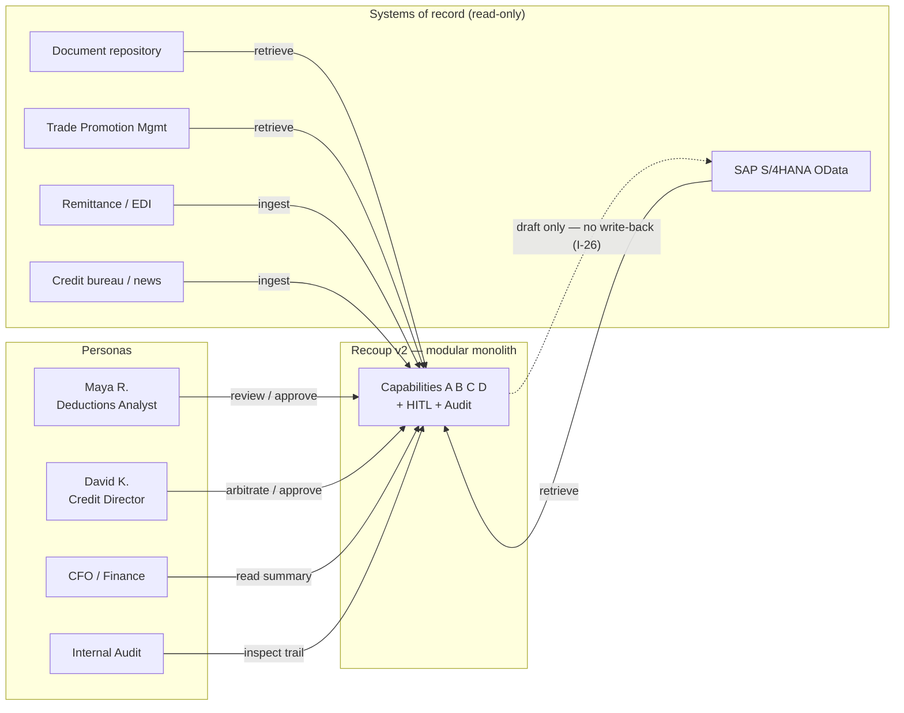
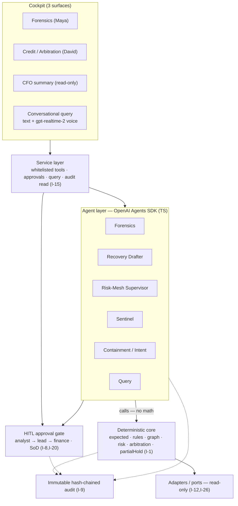
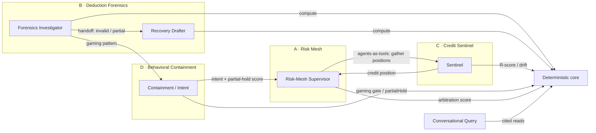
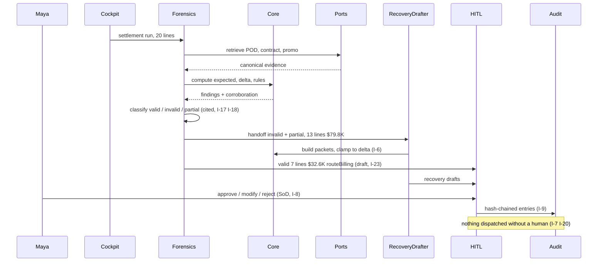
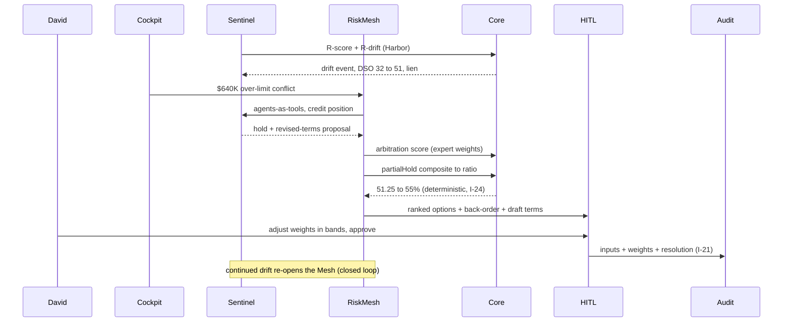
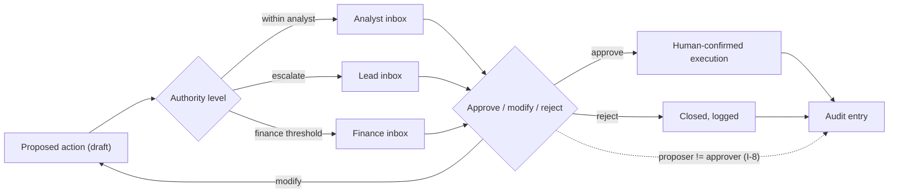
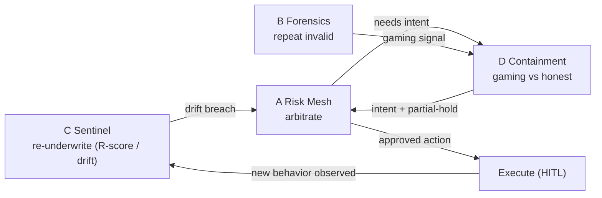
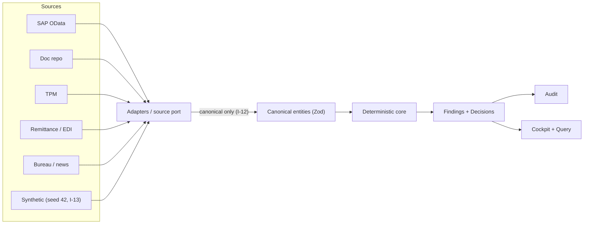
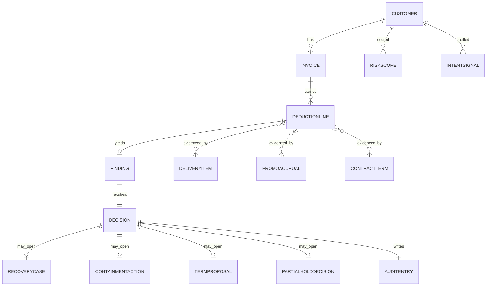

# Recoup v2 — System Design (Diagram Set)

Standalone visual companion to the SDD. Each diagram names the invariants/criteria it makes legible. Renders as Mermaid. Binds to `RECONCILIATION_LEDGER.md`, `OPENAI_STACK_DOSSIER.md`, `INVARIANTS.md`, `Recoup_v2_SDD.md`.

---

## 1. System context

External systems are **read-only**; the only outbound path to SAP is a **draft** with no write-back (I-26).

---

## 2. Container / layer view

The modular monolith with hexagonal ports. Agents never compute money (I-1); everything routes through the deterministic core and the HITL gate.

---

## 3. Agent interaction (handoffs + agents-as-tools)

TS-stable orchestration only; subagents deferred (Dossier §4). The Risk Mesh is the integrator.

---

## 4. Sequence — Maya · Deduction Forensics run (B)

---

## 5. Sequence — David · Risk Mesh + partial hold + Sentinel (A·C·D)

---

## 6. HITL approval flow (cross-cutting)

---

## 7. Closed-loop interaction (C → A → D → execute → C)

---

## 8. Data flow & port purity

Adapters return canonical entities only; the core has zero source-shaped imports (I-12). Synthetic and real SAP are interchangeable by config.

---

## 9. Canonical data model (ER)

---

## 10. Diagram → rubric mapping

| Diagram | Primary rubric axis it evidences |
|---|---|
| 1 Context | Real-World Relevance; Use of OpenAI (MCP/SAP) |
| 2 Layers | Technical Excellence (architecture, separation) |
| 3 Agent interaction | Innovation (agent-to-agent), Use of OpenAI (handoffs/agents-as-tools) |
| 4–5 Sequences | Innovation + Technical Excellence (the two hero journeys) |
| 6 HITL | Technical Excellence (reliability/SoD), Real-World Relevance |
| 7 Closed loop | Innovation (closed-loop mesh) |
| 8 Data flow | Technical Excellence (port purity), Scalability |
| 9 ER | Technical Excellence (data model) |

---

*End of System Design. Next: Phase F — AGENTS.md (Codex build protocol, mining the Best-Practice file), then G — Codex Setup Guide.*
