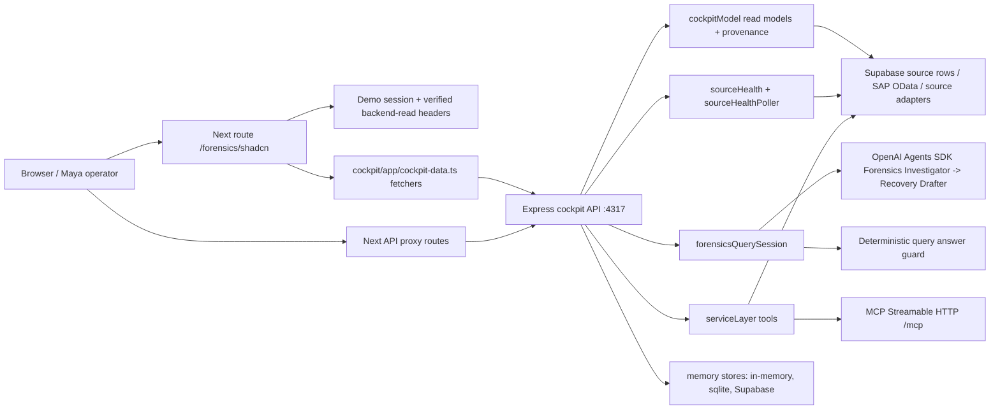

# Maya Shadcn Independent Audit Technical Design

Date: 2026-06-25

Purpose: give an independent technical auditor enough context to review the Maya Deduction Forensics journey end to end, including the shadcn frontend, backend API/read models, source tools, memory, prompt/agent library, startup commands, executed tests, and remaining work.

This document intentionally covers only the shadcn frontend path. The legacy frontend route is out of audit scope.

## Audit Scope

In scope:

- Maya Deduction Forensics shadcn route: `cockpit/app/forensics/shadcn/page.tsx`
- Maya shadcn components: `cockpit/components/maya/*.tsx`
- Next API proxy routes used by Maya: `cockpit/app/api/forensics/*`, `cockpit/app/api/connectors/route.ts`, `cockpit/app/api/approval/route.ts`, and realtime query proxy routes.
- Express cockpit backend API: `src/services/cockpitApi.ts`
- Read-model builders and provenance: `src/services/cockpitModel.ts`, `src/services/mayaDataProvenance.ts`
- Source health and polling: `src/services/sourceHealth.ts`, `src/services/sourceHealthPoller.ts`
- Forensics query orchestration: `src/services/forensicsQuerySession.ts`, `src/agents/forensics.ts`, `src/agents/liveForensicsStream.ts`, `src/agents/query.ts`
- Service tools and MCP facade: `src/services/serviceLayer.ts`, `src/mcp/server.ts`
- Memory stores and Supabase schema: `src/memory/*`, `docs/supabase-memory-schema.sql`
- Prompt library and agent runtime: `src/agents/prompts.ts`, `src/prompts/*.md`, `src/agents/agentRuntime.ts`
- Real-backend and component QA tests: `tests/e2e/maya-real-backend-e2e.ts`, `tests/invariants/maya-real-backend-contract.test.ts`, `tests/invariants/maya-shadcn-qa-contract.test.ts`, focused unit tests under `tests/unit/`.

Out of scope:

- Legacy Maya route: `cockpit/app/forensics/page.tsx`
- Fixture-only acceptance as proof of real backend readiness
- ERP write-back or autonomous external action execution
- Any frontend component that invents business values locally

## Governing Rules

The load-bearing rule from `AGENTS.md` applies to this audit:

- The model decides what to do, but code computes every dollar.
- Every decision must cite evidence plus deterministic basis.
- A human approves every external action.
- No model-computed dollar figure can reach a finding or decision.
- SAP, Supabase, OpenAI, and cockpit runtime coordinates are discovered from local env loaders such as `.env.local` and `config/localRuntimeEnv.ts`; secret values must not be pasted into docs, chat, tests, screenshots, or logs.

Relevant invariant anchors from `INVARIANTS.md`:

| Invariant | Audit meaning |
|---|---|
| I-1 | No model-computed money reaches decisions or findings. |
| I-7 / I-20 | All recovery, hold, term, billing, and external actions remain human gated. |
| I-17 | Every agent decision has cited `recordIds` and deterministic basis. |
| I-18 | Deduction invalid/partial classification requires supporting documents. |
| I-23 | Billing loop is draft-only. |
| I-25 | Runtime models are pinned in `config/models.ts`. |
| I-26 | No production ERP mutation path. |
| I-29 | Voice/text answers require citation parity. |
| I-30 | Cockpit-visible provenance must be honest; unknown data fails closed. |

## Current Implementation Status

The Maya shadcn real-backend plan in `docs/superpowers/plans/2026-06-24-maya-real-backend-agentic-hardening.md` records the ten implementation tasks as complete for the implemented Maya journey:

1. Real-backend contract tests
2. Field-level provenance
3. Real-backend mode and fail-closed API behavior
4. Real source health
5. Per-work-item backend endpoint
6. Real forensic query session
7. Real-backend browser acceptance test
8. Removal of static business values from 12 beats
9. Handoff/audit evidence
10. Final QA gate

Important caveats for an auditor:

- The working tree is currently dirty/untracked with nothing staged and includes many Maya/backend changes. Phase 0 reproducibility is not complete; review `git status --short` before treating this as a release candidate.
- The latest documented full proof pack is green in `docs/independent-audit-log.md` and `docs/storyboards/maya-shadcn-ui-handoff-status.md`: 2026-06-25 controller evidence shows `npm.cmd run verify` passed with lint, typecheck, 89 Vitest files / 737 tests, dependency-cruiser clean with 115 modules / 367 dependencies, and release readiness passed. An external auditor should rerun the commands in a clean checkout before signing release reproducibility.
- SAP OData is read-only. The local sandbox is expected to use the non-SSL HTTP base URL from `.env.local` through `SAP_ODATA_BASE_URL`; do not switch back to the expired HTTPS listener unless the certificate chain is renewed.
- The latest documented real-backend E2E says SAP OData is connected for S1-S6. S7/S8 SAP evidence remains intentionally fail-closed because of an owner/SAP customer mapping conflict; available docs/TPM/bureau evidence must not be relabeled as SAP.

## Architecture



The frontend does not own business truth. It renders typed read models and sends selected evidence scope back to the backend for detail and query operations. The backend either returns cited/provenanced data or fails closed.

## Shadcn Frontend

Primary route:

- `cockpit/app/forensics/shadcn/page.tsx`
- URL: `/forensics/shadcn`
- Login entry: `/login`, then Maya route access redirects into `/forensics/shadcn`

Route behavior:

- Calls `requireRouteAccess("/forensics/shadcn")` to require a Maya demo session.
- Calls `requireMayaBackendReadAuthHeaders()` from `cockpit/app/backend-read-auth.ts`.
- Fetches backend read models with `fetchForensicsModel()` and `fetchConnectorReadinessModel()`.
- Renders `MayaForensicsSurface`.

Major shadcn Maya components:

| Component | File | Audit role |
|---|---|---|
| Workspace shell | `cockpit/components/maya/maya-workspace-shell.tsx` | App chrome, shadcn navigation, Maya route container. |
| Forensics surface | `cockpit/components/maya/maya-forensics-surface.tsx` | Composes worklist, selected case, source readiness, and overlays. |
| KPI strip | `cockpit/components/maya/maya-run-kpi-strip.tsx` | Renders backend KPI read-model values only. |
| Source readiness | `cockpit/components/maya/source-readiness-strip.tsx` | Renders backend `/connectors` source health tiles. |
| Worklist | `cockpit/components/maya/deduction-worklist-table.tsx` | Displays backend worklist rows and supports row selection. |
| Case workspace | `cockpit/components/maya/deduction-case-workspace.tsx` | Displays selected work item detail, tabs, and return-to-worklist control. |
| Evidence dossier | `cockpit/components/maya/evidence-dossier.tsx` | Displays cited backend evidence documents. |
| Query dock | `cockpit/components/maya/query-evidence-dock.tsx` | Sends selected question + record IDs to backend query endpoint. |
| Agent trace | `cockpit/components/maya/agent-trace-panel.tsx` | Symbolic process map from backend trace events. |
| Cited answer | `cockpit/components/maya/cited-answer-card.tsx` | Displays deterministic backend answer and citations. |
| Recovery draft review | `cockpit/components/maya/recovery-draft-review.tsx` | Draft-only recovery/billing posture; no external dispatch. |
| Approval gate | `cockpit/components/maya/approval-gate-dialog.tsx` | Human approval UI; disabled/fail-closed when eligibility is missing. |
| Audit confirmation | `cockpit/components/maya/audit-confirmation-panel.tsx` | Audit state and backend contract gaps. |

Frontend data contract:

- Types live in `cockpit/app/cockpit-data.ts` and `cockpit/components/maya/types.ts`.
- Most visible Maya business fields include `provenance`.
- `MayaFieldProvenance` source kinds are `supabase`, `sap_odata`, `agent_trace`, `derived_backend`, and `operator_session`.
- Query prompt chips come from backend/read-model `promptSuggestions`; the query dock must fail closed if unavailable.
- The Agent Trace tab must show a nonblank symbolic map before and after a query, using backend/source-backed trace events rather than static local rows.

## Backend API

Primary backend:

- File: `src/services/cockpitApi.ts`
- Default port: `4317`
- Start command: `npm.cmd run start:api`
- Default data mode: `real-backend`, unless `RECOUP_DATA_MODE=fixture`

Important backend endpoints:

| Method | Path | Purpose |
|---|---|---|
| GET | `/healthz` | API health. |
| GET | `/login` | Login read model. |
| GET | `/forensics` | Maya forensics read model. |
| GET | `/forensics/work-items/:lineId` | Selected work item detail. |
| GET | `/connectors` | Source readiness/readiness tiles. |
| POST | `/forensics/query` | Maya cited query orchestration. |
| POST | `/approval` | Human approval request path; still governed. |
| POST | `/query/realtime-client-secret` | Realtime client secret proxy with verified human context. |
| POST | `/query/realtime-tool` | Realtime tool call proxy with verified human context. |
| GET/POST | `/run` | Forensics run stream/trigger. |
| GET | `/memory`, `/agents`, `/trace` | Audit/read-model surfaces for memory, agent roster, and trace state. |

Next API proxy routes:

- `cockpit/app/api/connectors/route.ts`
- `cockpit/app/api/forensics/work-items/[lineId]/route.ts`
- `cockpit/app/api/forensics/query/route.ts`
- `cockpit/app/api/approval/route.ts`
- `cockpit/app/api/query/realtime-client-secret/route.ts`
- `cockpit/app/api/query/realtime-tool/route.ts`

Auth and fail-closed behavior:

- Server-rendered Maya page forwards verified backend-read headers.
- Direct protected backend calls fail closed with `Verified human cockpit auth required.` when auth is absent.
- Missing governed source rows or missing required credentials should produce explicit unavailable/blocked states, not fake data.

## Read Models And Provenance

Read-model builder:

- `src/services/cockpitModel.ts`

Provenance helper:

- `src/services/mayaDataProvenance.ts`

The helper rejects:

- Blank source names
- Empty `recordIds` for non-operator-session business fields
- Blank record IDs
- Blank deterministic basis

Business-visible fields should be audited for one of these source categories:

| Source kind | Meaning |
|---|---|
| `sap_odata` | Live/read-only SAP OData evidence or SAP source health. |
| `supabase` | Supabase-backed evidence/read-model/source rows. |
| `agent_trace` | Backend OpenAI Agents SDK hook/trace receipt, not raw model text. |
| `derived_backend` | Deterministic backend computation from cited inputs. |
| `operator_session` | Current verified human/operator session context; no source record IDs required. |

The UI may format labels and layout, but must not compute dollar values, verdicts, routing, approval state, source state, or business decisions.

## Source Tools

Source adapters and retrieval tools:

| Area | Files | Status to audit |
|---|---|---|
| SAP OData | `src/adapters/sapOData.ts`, `src/tools/retrieval/sap.ts` | Read-only OData metadata/request-plan/evidence reads. No ERP write-back. |
| Supabase source rows | `src/adapters/supabaseSyntheticSource.ts`, `src/services/sapSupabaseEvidenceProvisioner.ts` | Supplies governed evidence rows and SAP-to-Supabase evidence provisioner output. |
| Docs repository | `src/adapters/docRepo.ts`, `src/tools/retrieval/docs.ts` | Source-backed document evidence. |
| TPM | `src/adapters/tpm.ts`, `src/tools/retrieval/tpm.ts` | Promotion/contract evidence. |
| Bureau | `src/adapters/bureau.ts`, `src/tools/retrieval/bureau.ts` | Bureau/risk evidence. |
| Remittance/EDI | `src/adapters/remittance.ts`, `src/adapters/ediRemittance.ts` | Remittance source readiness and evidence path. |
| Enterprise readiness registry | `src/adapters/connectorRegistry.ts` | Credential/schema/read-only proof metadata. |

Source health:

- `src/services/sourceHealth.ts` probes SAP with read-only GET metadata calls when credentials are configured.
- Non-SAP Day-1 sources derive readiness from connector/schema/read-only proof and may be labeled synthetic or unavailable.
- `src/services/sourceHealthPoller.ts` supports polling/persisting source health snapshots at a default 15-minute max-age cadence.
- SAP failed probes must show blocked/unavailable, not connected.

## MCP And Service Tools

MCP server:

- File: `src/mcp/server.ts`
- Start command: `npm.cmd run dev:mcp`
- Protocol endpoint: `/mcp`
- Transport: `StreamableHTTPServerTransport`
- Auth variables: `RECOUP_MCP_AUTH_TOKEN`, `RECOUP_MCP_CLIENT_PRINCIPAL`, optional `RECOUP_MCP_CLIENT_CAPABILITIES`

MCP-visible service tools come from `serviceToolMetadata` in `src/services/serviceLayer.ts`.

| Tool | Side-effect class | Audit posture |
|---|---|---|
| `retrieval.sap` | none | Read-only SAP evidence retrieval; fails closed without Supabase SAP evidence source. |
| `retrieval.docs` | none | Read-only document evidence retrieval. |
| `retrieval.tpm` | none | Read-only TPM evidence retrieval. |
| `retrieval.bureau` | none | Read-only bureau evidence retrieval. |
| `query.answer` | none | Read-only query answer tool requiring selected evidence scope. |
| `sources.r1Read` | none | Read-only R1 source provenance. |
| `actions.draftOutreach` | draft_only | Draft-only, no external send. |
| `actions.draftRebill` | draft_only | Draft-only, no billing dispatch. |
| `actions.proposeHold` | draft_only | Draft-only, no hold execution. |
| `actions.proposeTerms` | draft_only | Draft-only, no term change execution. |
| `actions.routeBilling` | draft_only | Draft-only route proposal. |

Internal decision/core tools must not be exposed through MCP. Existing invariants cover MCP visibility and transport.

## Agent And Prompt Library

Agent runtime:

- `src/agents/agentRuntime.ts`

Pinned models:

- `config/models.ts`
- Current entries: reasoning `gpt-5.5`, fast `gpt-5.4`, fast mini/nano variants, realtime `gpt-realtime-2`.

Agent roster:

| Agent | File/runtime | Model family | Prompt file |
|---|---|---|---|
| Forensics Investigator | `src/agents/agentRuntime.ts`, `src/agents/forensics.ts` | reasoning | `forensics-investigator.md` |
| Recovery Drafter | `src/agents/agentRuntime.ts`, `src/agents/recoveryDrafter.ts` | fast | `recovery-drafter.md` |
| Risk Mesh Supervisor | `src/agents/agentRuntime.ts`, `src/agents/riskMesh.ts` | reasoning | `risk-mesh-supervisor.md` |
| Sentinel | `src/agents/agentRuntime.ts`, `src/agents/sentinel.ts` | fast | `sentinel.md` |
| Containment Intent | `src/agents/agentRuntime.ts`, `src/agents/containment.ts` | fast | `containment-intent.md` |
| Conversational Query | `src/agents/agentRuntime.ts`, `src/agents/query.ts` | realtime | `conversational-query.md` |

Prompt loader:

- `src/agents/prompts.ts`
- Prompt files are loaded from `src/prompts/`.
- Empty prompt files throw at load time.

Maya query behavior:

- Backend endpoint `POST /forensics/query` calls `runForensicsQuerySessionWithLiveAgents`.
- It first builds a deterministic cited query answer from `runForensicsInvestigation`.
- It then requires a live OpenAI Agents SDK trace when live options and `OPENAI_API_KEY` are configured.
- The required live handoff is `Forensics Investigator -> Recovery Drafter`.
- Visible answer text remains deterministic and cited. Raw model text is suppressed by policy.

Why `rawModelTextPolicy: "suppressed"` is expected:

- Raw model stream/delta text is not allowed to become a business decision.
- The UI displays the deterministic backend answer, citations, source record IDs, and trace receipts.
- Agentic proof is carried through hook receipts, handoff count, agent names, trace rows, and deterministic basis, not by showing unguarded raw model prose.

## Memory

Runtime memory modules:

- `src/memory/schema.ts`
- `src/memory/store.ts`
- `src/memory/session.ts`
- `src/memory/compaction.ts`
- `src/memory/sqliteStore.ts`
- `src/memory/supabaseStore.ts`
- `src/memory/runtime.ts`

Supported runtime stores:

| Store | Trigger/config | Purpose |
|---|---|---|
| In-memory | default fallback | Local session state when no persistent backend is configured. |
| SQLite | `RECOUP_MEMORY_DB_PATH` | Local persistent memory store. |
| Supabase | `RECOUP_MEMORY_BACKEND=supabase` plus Supabase URL/key/table env | Governed persistent records and source health snapshots. |

Supabase schema:

- `docs/supabase-memory-schema.sql`
- Core table: `recoup_memory_records`
- Categories include session state, workflow state, case state, transaction state, evidence refs, approval records, audit refs, connector state, compaction summaries, artifact refs, and agent handoff packets.
- RLS is enabled and forced on `recoup_memory_records`.
- Access is revoked from `anon` and `authenticated`; service role gets controlled select/insert/update grants.
- Source health snapshots are also supported through `src/memory/supabaseStore.ts`.

Memory must not store direct PII or secrets. `MemoryRecordSchema` rejects payloads that match direct PII/secret patterns.

## Runtime Configuration

Do not paste secret values into audit artifacts. The auditor should verify only presence/absence and behavior.

Important env groups:

| Group | Variables to verify by name |
|---|---|
| API/frontend | `RECOUP_API_URL`, `RECOUP_DATA_MODE`, `PORT`, `RECOUP_COCKPIT_ALLOWED_ORIGINS` |
| Human auth/session | `RECOUP_COCKPIT_AUTH_TOKEN`, `RECOUP_COCKPIT_HUMAN_PRINCIPAL`, `RECOUP_DEMO_SESSION_SECRET`, `RECOUP_E2E_DEMO_PASSWORD` |
| SAP OData | `SAP_ODATA_BASE_URL`, `SAP_ODATA_USERID`, `SAP_ODATA_CLIENT_SECRET`, optional OAuth/token variables |
| Supabase | `SUPABASE_URL`, `SUPABASE_SERVICE_ROLE_KEY`, `RECOUP_SUPABASE_MEMORY_TABLE`, `RECOUP_MEMORY_BACKEND` |
| OpenAI | `OPENAI_API_KEY`, optional tracing/exporter variables |
| MCP | `MCP_PORT`, `RECOUP_MCP_AUTH_TOKEN`, `RECOUP_MCP_CLIENT_PRINCIPAL`, `RECOUP_MCP_CLIENT_CAPABILITIES` |

Env loaders:

- Backend API uses runtime env loading before starting `src/services/cockpitApi.ts`.
- Next-side backend reads use `config/localRuntimeEnv.ts` and route helpers under `cockpit/app/api/`.

## How To Start The App

Prerequisites:

- Node.js 22 or later, below 26
- Dependencies installed with `npm.cmd install`
- `.env.local` or equivalent local env file present with non-secret values validated by name

Recommended local startup in separate PowerShell terminals:

```powershell
npm.cmd run start:api
```

Expected API:

- `http://127.0.0.1:4317/healthz`
- Protected routes such as `/connectors` require verified human headers or a logged-in app session.

Start the shadcn cockpit:

```powershell
npm.cmd run dev:cockpit -- --hostname 127.0.0.1 --port 3000
```

Open:

- `http://127.0.0.1:3000/login`
- Login as Maya using the configured local demo password.
- Navigate to `/forensics/shadcn`.

Optional MCP server:

```powershell
npm.cmd run dev:mcp
```

If port 3000 or 4317 is busy, use an alternate cockpit port and set `RECOUP_API_URL` so the frontend points to the API you started.

## Real-Backend Acceptance Test Design

Main real-backend browser test:

- `tests/e2e/maya-real-backend-e2e.ts`
- Script: `npm.cmd run test:e2e:maya-real`

The harness is designed to prove human-like browser flow and real backend wiring:

- Visits `/login`.
- Logs in as Maya.
- Loads `/forensics/shadcn`.
- Asserts backend calls to `/forensics`, `/connectors`, `/forensics/work-items/:lineId`, and `/forensics/query`.
- Clicks one worklist row and verifies selected case detail.
- Opens Evidence, Query, Agent Trace, Draft, Approval, Audit, and Return-to-worklist beats.
- Runs four realistic Maya query scenarios.
- Compares backend query response trace rows to app response and rendered DOM rows.
- Rejects fixture API startup.
- Rejects Playwright `page.route`, `context.route`, `browserContext.route`, and `.fulfill()` real-backend bypass fragments.
- Captures Beat 1-through-12 screenshots under `output/playwright/e2e/real-backend/`.

Documented query scenarios:

| Scenario id | Query |
|---|---|
| `customer-dispute-response` | The customer says this was a valid shortage deduction. Which cited proof can I use to challenge it? |
| `manager-approval-brief` | What should I tell my manager before I ask for approval on the recovery draft? |
| `billing-vs-recovery-route` | Is this a billing correction or a recovery pursuit, and what proof drives that route? |
| `handoff-hitl-draft-gate` | Using only this selected evidence packet, have Forensics hand off to Recovery Drafter and confirm whether the recovery draft remains human-approval-gated. Which cited record IDs support that? |

Latest documented result:

- `npm.cmd run test:e2e:maya-real` passed against `http://127.0.0.1:4318`.
- Four Maya query scenarios executed.
- Thirty-two backend trace rows observed.
- The query reached live-agent-backed backend orchestration with Forensics Investigator -> Recovery Drafter hook receipts.
- SAP OData reported connected in source readiness.
- Non-SAP Day-1 sources remained explicitly synthetic-labeled when applicable.

## Tests Executed And Evidence

Latest documented proof pack in `docs/independent-audit-log.md` and `docs/storyboards/maya-shadcn-ui-handoff-status.md`:

| Command | Documented status | What it proves |
|---|---|---|
| `npm.cmd run lint` | Pass | ESLint gate. |
| `npm.cmd run typecheck` | Pass | TypeScript gate. |
| `npm.cmd run test` | Pass | Unit/invariant suite; documented 89 Vitest files / 737 tests in the 2026-06-25 proof pack. |
| `npm.cmd run depcruise` | Pass | Dependency-cruiser architecture/port-purity gate; documented clean with 115 modules / 367 dependencies in the 2026-06-25 proof pack. |
| `npm.cmd run verify:release` | Pass | Release readiness/eval gate. |
| `npm.cmd run verify` | Pass | Combined proof pack. |
| `npm.cmd run test:e2e:maya-real` | Pass | Real-backend browser acceptance with no fixture API or Playwright fulfillment. |
| `npm.cmd run test -- tests/invariants/maya-shadcn-qa-contract.test.ts` | Pass in latest focused QA | Component-specific hooks, prompt chips, symbolic agent map, return-to-worklist, and palette guard. |

Key focused tests for independent rerun:

```powershell
npm.cmd run test -- tests/invariants/maya-real-backend-contract.test.ts
npm.cmd run test -- tests/invariants/maya-shadcn-qa-contract.test.ts
npm.cmd run test -- tests/unit/forensics-query-session.test.ts
npm.cmd run test -- tests/unit/source-health.test.ts
npm.cmd run test -- tests/unit/source-health-poller.test.ts
npm.cmd run test -- tests/unit/sap-supabase-evidence-provisioner.test.ts
npm.cmd run test -- tests/invariants/mcp-visibility.test.ts tests/invariants/mcp-transport.test.ts
npm.cmd run test:e2e:maya-real
npm.cmd run verify
```

Recent browser screenshot evidence also exists under:

- `output/playwright/e2e/real-backend/`
- `output/playwright/manual-qa/`

The manual-qa screenshots include login, worklist, case, evidence, query-open, query-answer, agent-trace, and return-worklist snapshots after the neutral shadcn palette pass.

## Independent Audit Checklist

Use this as the minimum audit script.

1. Confirm only `/forensics/shadcn` is used for frontend review.
2. Run `git status --short` and record the dirty files.
3. Start API and cockpit with the commands above.
4. Log in as Maya from a real browser.
5. Verify `/forensics/shadcn` loads without "Unable to load the cockpit".
6. Click a worklist row and verify `/api/forensics/work-items/:lineId` is called.
7. Confirm all visible business values have backend/read-model provenance or explicit unavailable state.
8. Open Evidence and verify record IDs match backend evidence packet.
9. Submit each documented Maya query scenario.
10. Confirm `/api/forensics/query` returns an answer only with citations, deterministic basis, and trace rows.
11. Confirm Agent Trace tab is nonblank before and after query.
12. Confirm the visible answer does not expose raw model text as business truth.
13. Confirm draft, approval, billing-route, and audit views remain human gated and do not dispatch external actions.
14. Confirm SAP source health uses configured HTTP sandbox base URL and read-only probes.
15. Confirm any synthetic/unavailable source is labeled as such and not made green/connected by UI copy.
16. Confirm MCP tool list excludes internal core/decision tools.
17. Run the focused tests and `npm.cmd run verify`.
18. Inspect screenshots for component-level usability, return-to-worklist behavior, and no decorative/fake-only components.

## Known Gaps And Follow-Ups

These are not excuses; they are audit items that should stay visible until resolved.

| Area | Current state | Next step |
|---|---|---|
| Clean release branch | Worktree is dirty/untracked with nothing staged; Phase 0 reproducibility is not complete. | Create a clean review branch or PR, then rerun proof pack before claiming a commit-clean or reproducible release candidate. |
| S7/S8 SAP coverage | SAP evidence intentionally unavailable because owner/SAP customer mapping conflicts. | Reconcile mapping with owner/SAP source, then repopulate/prove `recoup_src_sap` coverage. |
| Non-SAP live source expansion | Some Day-1 sources may be Supabase/synthetic-labeled. | Replace synthetic-labeled source contracts with live external integrations where required. |
| Full external audit evidence | Current docs record internal/subagent/controller evidence. | Independent auditor should rerun tests, collect fresh logs/screenshots, and sign a separate audit report. |
| OpenAI trace export | App-level trace rows are asserted; exporter may warn if no tracing key is configured. | Configure tracing/export if external observability is required, without exposing raw model text. |
| Token accounting | `modelExecution.tokenUsage` is captured when returned by the live runner. | Capture and archive token usage for the external audit run. |
| Production rollout | Local real-backend journey is green in docs. | Define deployment target, monitoring, cost limits, incident process, and rollout mode before production. |
| Gold cases | Existing tests cover implemented scenarios. | Owner should approve labeled valid/invalid/partial deduction gold cases and edge cases. |
| Business thresholds | No invented constants allowed. | Owner approval is still needed for thresholds/weights/policy decisions not locked by config. |

## What The Auditor Should Not Accept

Reject the solution if any of these are found in the real-backend acceptance path:

- Fixture API process used as proof of real backend readiness.
- Playwright `page.route` or `.fulfill()` mocking `/forensics`, `/connectors`, `/forensics/query`, or work-item detail.
- UI-only arrays of business records, amounts, decisions, source statuses, or prompts.
- SAP source shown connected when health probe failed or credentials/source mapping are missing.
- Raw model text used as the cited business answer.
- Any external action sent without human approval.
- Any ERP write-capable client or mutation path.
- Missing citations, missing deterministic basis, or citations outside the selected evidence packet.

## Recommended Next Step

For independent audit, create a clean branch/snapshot and ask the reviewer to run:

```powershell
git status --short
npm.cmd run lint
npm.cmd run typecheck
npm.cmd run test
npm.cmd run verify
npm.cmd run test:e2e:maya-real
```

Then have the reviewer manually execute the Maya browser journey at `/forensics/shadcn`, compare the rendered fields to backend responses, inspect MCP tool exposure, and produce a signed finding list against the checklist above.

Do not accept Phase 0 reproducibility until `git status --short` is clean or the intended release diff is staged on a clean branch and the proof pack is rerun from that state.
