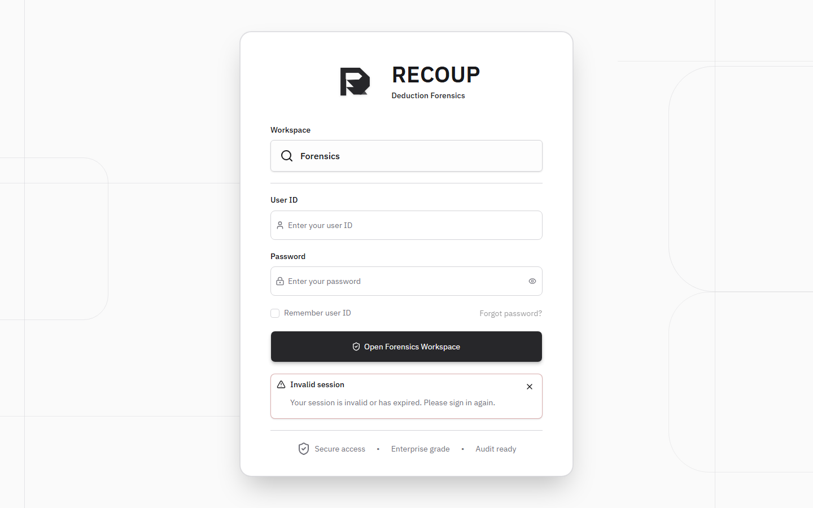

# Maya 12-Beat Browser Testing Storyboard

Generated from the local real-browser command:

```powershell
npm.cmd run test:e2e -- --maya-shadcn-only
```

Last observed result: PASS. The command checked Maya Beat 1 through Beat 12 and wrote the screenshots under `output/playwright/e2e/`.

Mobile QA is intentionally skipped for this pass per owner direction on 2026-06-26. The desktop 12-beat path remains the release evidence for this revamp slice.

## Scenario Table

| Beat | Scenario | Browser actions | Assertions covered | Screenshot |
|---:|---|---|---|---|
| 1 | Login entry | Open `/login`; verify blank user ID; fill demo login; submit with delayed login route. | No persona chooser/prefilled Maya identity; pending feedback appears; unavailable forgot-password control is disabled. | `output/playwright/e2e/maya-beat-01-login.png` |
| 2 | Logged-in Overview/dashboard | Open `/forensics/shadcn` as Maya; inspect Overview; click Recoup Agent launcher; switch to Worklist; select/open a row. | Overview has backend-backed KPI/source/worklist content; valid deductions are visible; launcher opens grounded query dock; row click does not fetch detail until explicit open; launcher intent does not replay. | `output/playwright/e2e/maya-beat-02-dashboard.png` |
| 3 | Worklist recommended action | Open Worklist; inspect selected row and alternate row. | Recommended action, verdict, amount, queue, routing, and evidence labels match read-model rows; row mismatch is fail-closed. | `output/playwright/e2e/maya-beat-03-recommended-action.png` |
| 4 | Case Overview | Open a case detail; verify header, line selector, Overview tab, notes, and overview facts. | Amount is read-only; line selector uses accessible buttons; no fake draft/action controls; Overview tab responds and stays backend-backed. | `output/playwright/e2e/maya-beat-04-case-overview.png` |
| 5 | Evidence dossier | Open Evidence tab; expand all business groups; open Source details. | Evidence leads with business document groups; raw record IDs are checked only after opening source details; citations, document IDs, source labels, and verification labels remain available. | `output/playwright/e2e/maya-beat-05-evidence-dossier.png` |
| 6 | Query start | Open Query Evidence dock from Evidence tab; type a question without submitting external actions. | Query dock shows selected evidence context, selected line, backend record badges, and prompt chips; overlay does not obscure evidence workspace. | `output/playwright/e2e/maya-beat-06-query-start.png` |
| 7 | Agent Trace running | Submit a held backend query; inspect running state and trace. | Stop button visible; skeletons show while running; agent trace is a business timeline first; technical trace details remain behind disclosure; no OpenAI/external action routes are called by the UI. | `output/playwright/e2e/maya-beat-07-agent-trace.png` |
| 8 | Cited answer | Fulfill backend query with cited response; inspect answer review. | Answer, deterministic basis, citations, exact metadata joins, and unavailable metadata gaps are rendered from backend response/evidence packet. | `output/playwright/e2e/maya-beat-08-cited-answer.png` |
| 9 | Draft review | Open Draft tab; inspect draft, action inbox, and evidence table. | Draft fields and evidence rows match backend detail; raw action IDs are not promoted as primary business copy; available controls are reachable. | `output/playwright/e2e/maya-beat-09-draft-review.png` |
| 10 | Human approval | Open Human approval gate. | Decision buttons remain disabled until backend exposes approval eligibility; user principal gaps are shown honestly; no approval submission is dispatched. | `output/playwright/e2e/maya-beat-10-human-approval.png` |
| 11 | Audit confirmation | Open Audit tab. | Audit summary is business-readable; receipt rows are collapsed behind details; unavailable committed receipt fields are not faked. | `output/playwright/e2e/maya-beat-11-audit-confirmation.png` |
| 12 | Return to worklist | Return from case detail to worklist. | Worklist focus is local; audit status remains unavailable; no fake next-case/audit-success claims appear. | `output/playwright/e2e/maya-beat-12-return-worklist.png` |

## Screenshot Storyboard

### Beat 1: Login



### Beat 2: Overview Dashboard


### Beat 3: Recommended Action


### Beat 4: Case Overview


### Beat 5: Evidence Dossier


### Beat 6: Query Start


### Beat 7: Agent Trace


### Beat 8: Cited Answer


### Beat 9: Draft Review


### Beat 10: Human Approval


### Beat 11: Audit Confirmation


### Beat 12: Return Worklist


