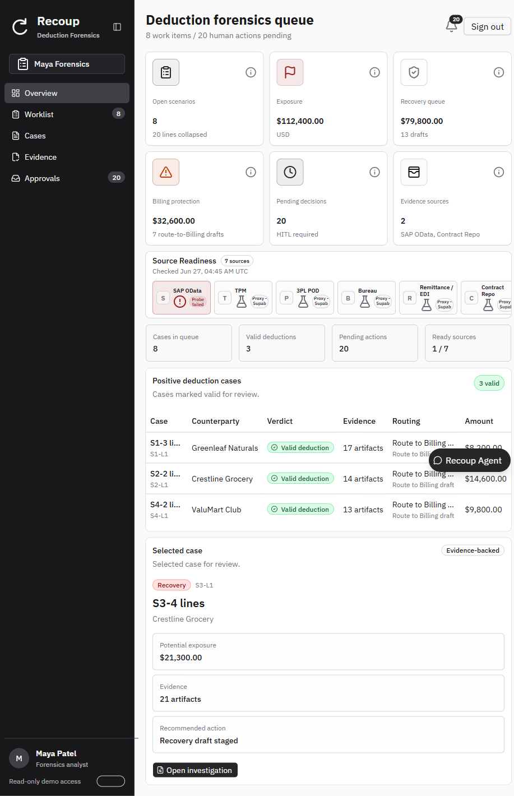
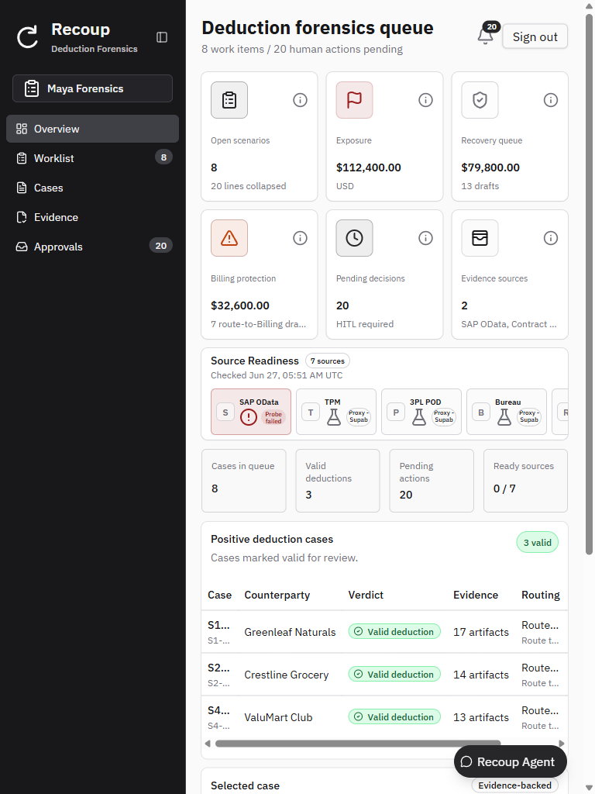
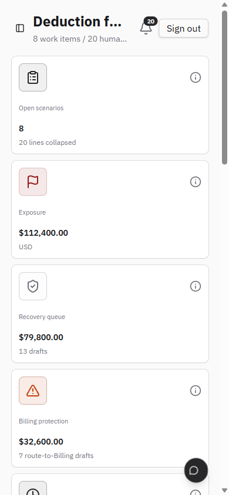
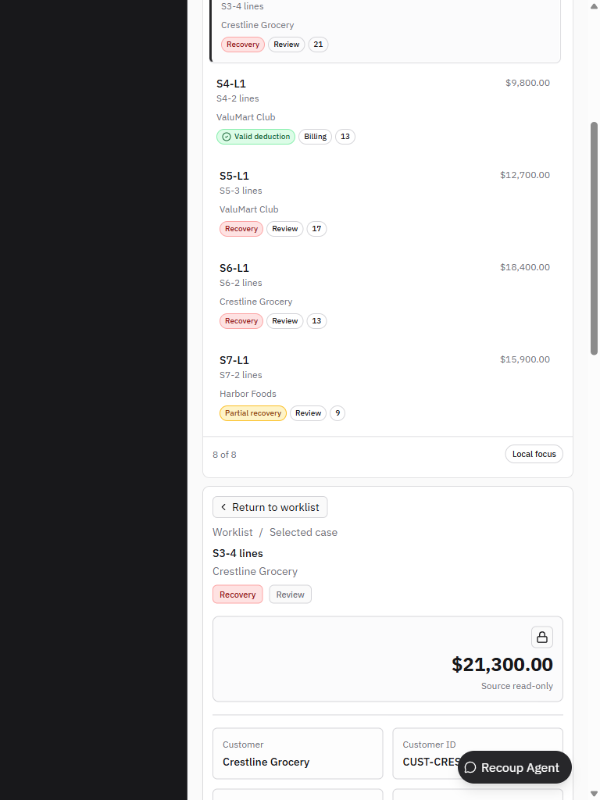
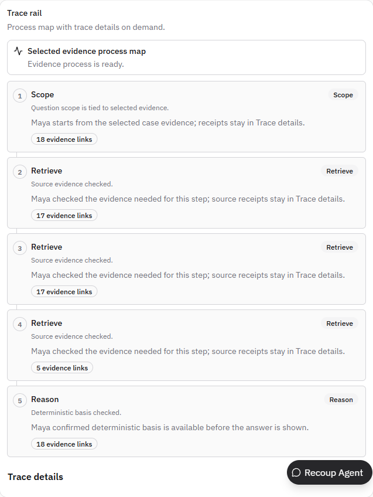
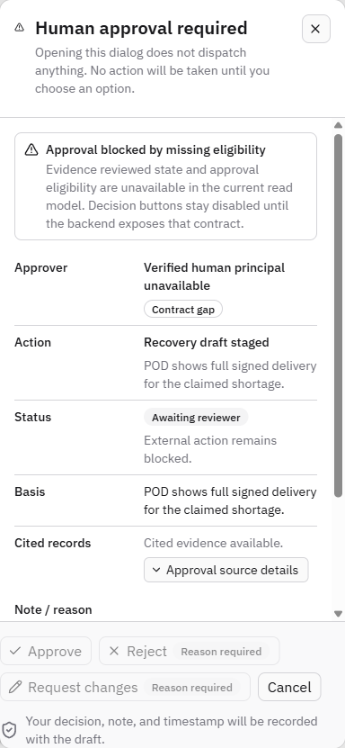
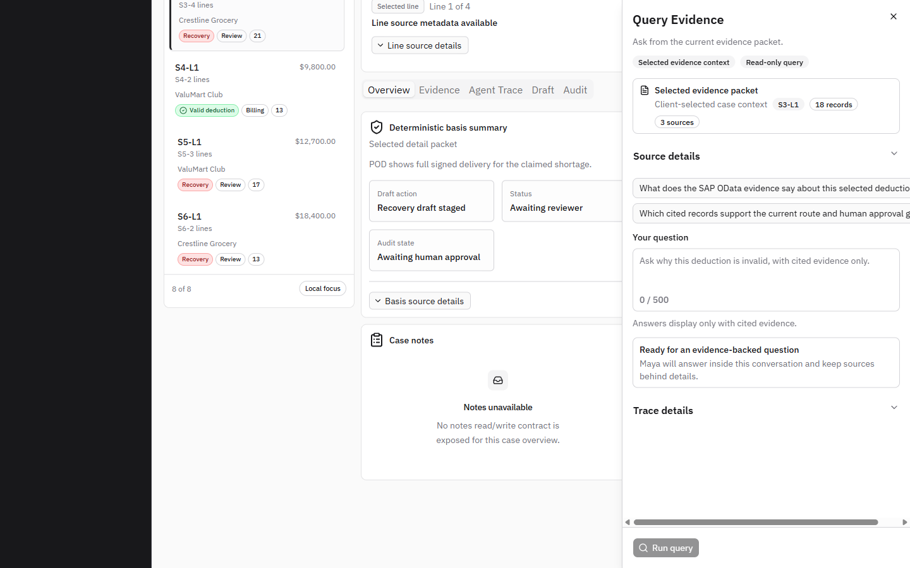

# Recoup Cockpit — Round 2 Per-View Target Design Spec

Date: 2026-06-27
Author role: Principal UX/UI Auditor · Visual Design Director · Lead Frontend QA
Target: `https://recoup-self-eta.vercel.app` (branch `codex/maya-ux-production-revamp`)
Companion doc: [external-ui-ux-look-and-feel-audit-report.md](external-ui-ux-look-and-feel-audit-report.md) (findings, P0/P1, token/shadcn fix idioms)

> **Purpose.** This document answers "what should each page actually look like?" It defines a **research-backed target design for all 12 distinct views**, grounded in a **live multi-breakpoint browser inspection** (desktop 1440, tablet 1024/768, mobile 390) done this session. It is written for an automated implementer (Codex): every recommendation names the existing shadcn component, the token, and the responsive behavior. **No code was changed to produce this doc.**

---

## A. Method & Evidence

- **Live pass:** authenticated as Maya, walked all surfaces, captured screenshots at **1440 / 1024 / 768 / 390** px. Console errors: **0**.
- **Quantified density/color (live):** Overview = 206 words / 23 badges / **0 charts** / 8% chromatic; Worklist+detail = 273 words / 44 badges / 12% chromatic / 9 raw IDs visible.
- **Screenshots:** `docs/qa/screenshots/round2/` — `r2-overview.png` (1440), `r2-overview-1024.png`, `r2-overview-768.png`, `r2-overview-390.png`, `r2-worklist.png`, `r2-agent-trace.png`, `r2-approval.png`, `r2-case-768.png`, `r2-query-dock.png`. Round-1 set in `docs/qa/screenshots/`.

### Research principles applied (best-in-class enterprise SaaS, 2025–26)

1. **Progressive disclosure is the deciding factor.** Surface ~3 role-specific KPIs above the fold; push the other 40 and all deep-dives below or on-demand. ([UX Collective](https://uxdesign.cc/design-thoughtful-dashboards-for-b2b-saas-ff484385960d), [Orbix](https://www.orbix.studio/blogs/b2b-saas-dashboard-design-examples))
2. **Visual-first, role-first landing.** Lead with KPIs + a line/area trend, two-column, with breathing room — not raw tables. ([UX Collective](https://uxdesign.cc/design-thoughtful-dashboards-for-b2b-saas-ff484385960d))
3. **Real-time AR/deductions dashboards** give "health at a glance" across credit, collections, cash-app and **deductions** — visualization first, record detail second. ([LedgerUp](https://www.ledgerup.ai/resources/accounts-receivable-automation-for-b2b-saas))
4. **shadcn building blocks** for this exact job: `Card` (KPI), `ChartContainer`+Recharts (area/bar/donut — needs `min-h-*`/`aspect-*`), `DataTable` (sort/filter), `Tabs`, **`Sheet`/`Drawer` for mobile actions**, responsive **sidebar that becomes a Sheet on mobile**. ([shadcn Charts](https://ui.shadcn.com/docs/components/radix/chart), [shadcn Blocks](https://ui.shadcn.com/blocks))

---

## B. The 12 Distinct Views

| # | View | Route / Entry | Current Score |
|---|---|---|---:|
| 1 | Login | `/login` | 4.4 |
| 2 | Overview / Queue landing | `/forensics/shadcn` (Overview) | 3.2 |
| 3 | Worklist | Overview → Worklist | 3.9 |
| 4 | Cases | sidebar → Cases | 3.7 |
| 5 | Evidence (section) | sidebar → Evidence | 3.6 |
| 6 | Approvals (action inbox) | sidebar → Approvals | 4.0 |
| 7 | Case detail — **Overview tab** | open a case | 3.6 |
| 8 | Case detail — **Evidence dossier tab** | case → Evidence | 3.7 |
| 9 | Case detail — **Agent Trace tab** | case → Agent Trace | 4.0 |
| 10 | Case detail — **Draft review tab** | case → Draft | 3.6 |
| 11 | Case detail — **Audit tab** | case → Audit | 3.2 |
| 12 | Recoup Agent / Query dock (+ Approval modal) | FAB / "Query evidence" | 3.4 |

Overall: **3.6 / 5 — FAIL** (anything < 4 is not production-ready). Two views block the pass for this directive: **#2 Overview (no charts, deep-dive-as-primary)** and **#11/#12 + #10's inert approval action**.

---

## C. Per-View Target Design

Legend: **Now** = live current state · **Target** = research-backed redesign · **Responsive** = breakpoint behavior · **Build** = shadcn/token specifics.

### 1. Login — 4.4 (near-pass)
- **Now:** Centered card, brand mark, business trust row. Clean. Empty side-zones ≥1440; "Forgot password?" is an inert link.
- **Target:** Split layout — left 60% brand/value panel (one line of product value + a subtle data-motif), right 40% the auth card. Make "Workspace / Forensics" a static context chip, not a search-styled input.
- **Responsive:** Below `md`, drop the left panel, center the card (current behavior is fine).
- **Build:** `grid lg:grid-cols-[1.4fr_1fr]`; remove the disabled `Button variant="link"` ("Forgot password?") or replace with muted helper text.

### 2. Overview / Queue landing — 3.2 ❌ (the headline failure) — **see dedicated redesign in §C-2★ below**
- **Now:** 6 KPI cards (good) **but flat grey numbers, no trend**; a Source-Readiness strip; an "intelligence grid"; then a **raw "Positive deduction cases" table** and — worst — a stacked **single-record "Selected case" deep-dive** (Potential exposure / Evidence / Recommended action for S3-4) as primary content. **0 charts.** `r2-overview.png`.
- **Target (visual-first triage cockpit):**
  - **Row 1 — KPI band (3–6 cards):** keep, but add per-card **trend delta (▲/▼ %)** + a **12-week sparkline**, and **color the metric icon** (Exposure → `--color-accent`, Recovery → success, Billing protection → warning).
  - **Row 2 — charts (the missing layer):** two-column — **(a) Exposure by aging/scenario bar chart**, **(b) Recovery vs Billing split donut**. This is the single change that makes it read as a cockpit.
  - **Row 3 — "Needs Maya now":** a *compact* prioritized action list (top 3–5 work items by exposure), each row = verdict dot + customer + amount + one CTA. Not a full table.
  - **Remove from landing:** the inline "Selected case" deep-dive (belongs behind *Open investigation*) and the full positive-cases table (lives in Worklist).
- **Responsive:** KPI `grid-cols-2 md:grid-cols-3 xl:grid-cols-6`; charts stack `grid md:grid-cols-2`; action list always single-column.
- **Build:** `ChartContainer` (set `min-h-[220px]`) + Recharts `BarChart`/`PieChart`; KPI delta `inline-flex items-center gap-1 text-xs text-[color:var(--status-success-text)]` with `lucide TrendingUp/Down`.

---

### ★ C-2. OVERVIEW REDESIGN (detailed) — making the landing intuitive

**The problem in one sentence:** today the Overview answers *"here is every field we have about records"*; it must instead answer Maya's three triage questions in 5 seconds: **(1) How much money is at stake and which way is it trending? (2) Where is it concentrated? (3) What do I action first?**

**Target layout (desktop ≥xl) — 4 stacked bands, progressive disclosure:**

```
┌────────────────────────────────────────────────────────────────────────────┐
│  Deduction forensics queue            Jun 27 · 8 work items · 20 to action   │  ← context header (have it ✅)
├────────────────────────────────────────────────────────────────────────────┤
│  BAND 1 — HERO KPIs (3 cards, not 6)                                         │
│  ┌───────────────┐ ┌───────────────┐ ┌───────────────┐                      │
│  │ Exposure      │ │ Recovery queue│ │ Pending HITL  │   each card:         │
│  │ $112,400  ▲4% │ │ $79,800   ▲2% │ │ 20        ▼3  │   value + delta +    │
│  │ ╱╲___╱ sparkl │ │ ___╱╲╱ sparkl │ │ ▁▂▅▃ sparkl   │   12-wk sparkline    │
│  └───────────────┘ └───────────────┘ └───────────────┘   accent-tinted icon │
│  (Billing protection / Evidence sources / Open scenarios → demote to Band 4) │
├────────────────────────────────────────────────────────────────────────────┤
│  BAND 2 — VISUAL CONCENTRATION (the missing chart layer)                     │
│  ┌────────────────────────────────┐ ┌─────────────────────────────────────┐ │
│  │ Exposure by scenario/aging     │ │ Disposition mix (donut)             │ │
│  │  ▆▆▆▆ Shortage   $42k          │ │   ◐  Recovery 5 · Billing 3         │ │
│  │  ▆▆▆  Pricing    $31k          │ │      Valid 3 · Dispute 0            │ │
│  │  ▆▆   Promo      $22k          │ │   center label: $112,400 total      │ │
│  │  ▆    POD        $17k          │ │                                     │ │
│  └────────────────────────────────┘ └─────────────────────────────────────┘ │
├────────────────────────────────────────────────────────────────────────────┤
│  BAND 3 — "NEEDS MAYA NOW" (top 3–5 by exposure, NOT the full table)         │
│  ● Recovery  Crestline Grocery   S3-4   $21,300   [ Open investigation → ]   │
│  ● Recovery  Harbor Foods        S8-2   $18,400   [ Open investigation → ]   │
│  ● Partial   Harbor Foods        S7-2   $15,900   [ Open investigation → ]   │
│  (verdict = colored dot; amount tabular-nums right; one CTA; "View all 8 →") │
├────────────────────────────────────────────────────────────────────────────┤
│  BAND 4 — SYSTEM STATUS (secondary, smaller, muted)                         │
│  Source readiness tiles · secondary KPIs · "checked 05:51 UTC"              │
└────────────────────────────────────────────────────────────────────────────┘
```

**What changes vs. today (concrete):**
| Move | Today | Target | Why |
|---|---|---|---|
| **Add charts** | 0 charts | 2 charts (Band 2) | The single biggest "cockpit not debug log" lever |
| **Cut hero KPIs 6 → 3** | 6 equal grey cards | 3 hero + 3 demoted | "3 KPIs above the fold" research principle; reduces grey-pill noise |
| **Add trend** | flat numbers | delta % + sparkline | "which way is it moving" — the analyst's first question |
| **Remove deep-dive** | inline "Selected case" S3-4 block | gone (lives behind *Open investigation*) | stop forcing a single record's internals onto the landing |
| **Replace raw table** | full "Positive deduction cases" table | compact top-5 action list | progressive disclosure; full list is the Worklist's job |
| **Demote system status** | mid-page intelligence grid | small Band 4 | source readiness is reassurance, not the headline |

**Color (no new tokens):** hero icons tinted by meaning — Exposure `--color-accent` (#C2410C), Recovery `--status-success-text`, Pending `--status-warning-text`; chart series use the existing aging ramp (`--aging-current … --aging-90plus`, already in `tokens.css`); verdict dots use the status ramp. Money stays neutral + `tabular-nums`.

**Build (shadcn/Recharts, all already supported):**
- KPI: `Card` + `<ChartContainer className="h-10 w-24">` sparkline (`AreaChart`) + delta badge.
- Band 2: `<ChartContainer className="min-h-[220px]">` with Recharts `BarChart` (exposure) and `PieChart` innerRadius donut; wrap in `Card`. Set a `ChartConfig` mapping series→`var(--aging-*)`.
- Band 3: plain `div` rows (`divide-y`), not a `Table` — `grid grid-cols-[auto_1fr_auto_auto_auto] items-center gap-3`; verdict dot `size-2 rounded-full bg-[color:var(--status-…-text)]`.
- Layout: `grid gap-4`; Band 2 `md:grid-cols-2`; KPI `grid-cols-1 sm:grid-cols-3`.

**Responsive:** Band 1 `grid-cols-1 sm:grid-cols-3`; Band 2 charts stack on `<md` (keep `min-h` so Recharts renders); Band 3 stays single-column; Band 4 tiles `grid-cols-3 sm:grid-cols-4 lg:grid-cols-7` (fixes the 768 clipping).

**Acceptance check:** above the fold at 1440 a judge should see — in order — money (with trend), a chart, and the top action. Zero raw IDs, zero record deep-dive, ≤ ~12 badges on the landing.

### 3. Worklist — 3.9
- **Now:** Dense table, **verdict color now present** (✅), 64→44 badges, but 9 raw IDs + `lineId` subtext per row. `r2-worklist.png`.
- **Target:** Lead each row with a **verdict color dot** + customer + amount (right-aligned `tabular-nums`); cap to **2 badges/row** (verdict + queue). Sticky toolbar: search + verdict/queue filters + result count. Move evidence-score/routing-dupe to a hover or the detail.
- **Responsive:** `md` and below → **card list** (already partially present), not a horizontally-scrolling table. Each card: title row (id+amount), customer, 2 badges.
- **Build:** shadcn `DataTable` with column visibility; on `max-md` render the existing mobile card list; hide `lineId` subtext (`deduction-case-workspace.tsx` line selector + worklist).

### 4. Cases — 3.7
- **Now:** Clean table (Case / Counterparty / Verdict / Queue) but **large empty zone** below a short table; grey-on-white.
- **Target:** Add a thin **summary bar** above the table (counts by verdict as colored chips: N valid / N recovery / N dispute) so the empty space becomes a scannable distribution. Zebra rows; verdict dot.
- **Responsive:** table → card list at `md`; summary chips wrap.
- **Build:** chips use the status tokens; `divide-y` rows; `even:bg-muted/30`.

### 5. Evidence (section) — 3.6
- **Now:** "Selected evidence" facts + source-readiness rail; cleaner than R1 but sparse, lots of whitespace.
- **Target:** Make it an **evidence coverage view**: a small **stacked-bar / coverage meter** (artifacts by type: POD / Invoice / Contract / TPM) + the source-readiness tiles with status color. Lead with "what evidence exists," not prose.
- **Responsive:** coverage chart full-width on mobile; tiles `grid-cols-2 sm:grid-cols-4`.
- **Build:** `ChartContainer` mini bar; reuse `source-readiness-strip.tsx` tiles (already color-aware).

### 6. Approvals (action inbox) — 4.0 (best data surface)
- **Now:** Dense, business-readable Action-inbox table with real amounts; no gap copy. Strong.
- **Target:** Minor — add a **status color** to "Awaiting reviewer" (warning chip) and a right-aligned **bulk "Open approval" affordance** per row; sticky header.
- **Responsive:** table → card list at `md` (Line · Action · Amount · status chip).
- **Build:** `sticky top-0 bg-background` table header; warning-token chip.

### 7. Case detail — Overview tab — 3.6
- **Now:** Header (case + read-only amount), line selector exposing raw `lineId`, fact grid, tabs. Functional but text-dense; raw `CUST-CRES…` ID visible.
- **Target:** Header = **case title + customer + verdict pill + big read-only amount** (keep the lock treatment — it's good). Replace the raw-ID line-selector subtext with "Line 1–4" chips only (IDs behind "Line source details", which already exists). Fact grid → 3–4 KPI-style mini-cards (Exposure / Evidence count / Queue / Recommended action).
- **Responsive:** 3-pane workbench → **stacked single column** at `<lg` (worklist rail collapses to a top "Back to worklist" + the detail). `r2-case-768.png` shows this works; just ensure the rail collapses rather than stacking the whole list.
- **Build:** `grid lg:grid-cols-[280px_1fr]`; at `<lg` hide the rail behind a `Sheet` triggered by "Worklist".

### 8. Case detail — Evidence dossier tab — 3.7
- **Now:** Grouped accordions (Invoice/POD) + source provenance rail + a "Deterministic basis unavailable / Contract gap" alert beside live content; SAP doc names lead rows.
- **Target:** Lead each evidence row with the **business label** (Proof of Delivery, Invoice) and put the SAP key as muted secondary. Demote the "Contract gap" alert to a single quiet inline note. Add a small **evidence-coverage chip row** at top (4 POD · 3 Invoice · 2 Contract).
- **Responsive:** accordions full-width; provenance rail moves below content at `<xl`.
- **Build:** keep `Collapsible` "Source details" for IDs (already correct); alert → `text-xs text-muted-foreground` note.

### 9. Case detail — Agent Trace tab — 4.0 ✅ (most improved)
- **Now:** Plain-language **Scope → Retrieve → Reason** steps with "N evidence links"; infra names hidden; receipts in "Trace details". `r2-agent-trace.png`. Big improvement over R1.
- **Target:** Convert the **vertical text-card list into a horizontal stepper/timeline** with an icon per phase (`ScanSearch → Database → Brain → ShieldCheck`) and a connecting rail; collapse the 3 near-identical "Retrieve" cards into one with a count ("Retrieved 4 sources"). This is the "agentic visual timeline, not a wall of text" principle.
- **Responsive:** horizontal stepper → vertical at `<md` (the current vertical layout is the mobile fallback).
- **Build:** `<ol className="flex items-center gap-2 overflow-x-auto md:flex-row flex-col">` with `after:` connector lines; keep "Trace details" `Accordion`.

### 10. Case detail — Draft review tab — 3.6
- **Now:** Read-only amount block (good), tabs, evidence table, but a **"Backend gaps" list** in the rail and **two no-op command-bar buttons** ("Request changes" / "Reject draft" only change a caption).
- **Target:** Remove the "Backend gaps" list. Make the command bar 3 real actions or 1 — wire "Request changes"/"Reject draft" to open the approval dialog pre-set to that decision, or remove them and keep one primary **Open approval**. Lead with: draft summary card + cited evidence; basis as one line.
- **Responsive:** rail collapses below content at `<xl`; command bar becomes a sticky bottom bar on mobile.
- **Build:** sticky `bottom-0` command bar `border-t bg-background`; primary button uses success token when enabled.

### 11. Case detail — Audit tab — 3.2 ❌
- **Now:** "Unavailable / 3 missing / 5 unavailable receipt fields", raw-ID grid, disabled "View audit trail". Reads as a debug receipt.
- **Target:** A **receipt timeline**: a vertical stepper (Decision recorded → Hash committed → Evidence cited) with a clear state badge; show only the fields that exist as a clean 2-column definition list; hide the "unavailable field" rows behind a "Pending fields (N)" disclosure. Hash shown as a copyable mono chip, not a wall.
- **Responsive:** definition list `grid sm:grid-cols-2`; timeline full-width.
- **Build:** demote `unavailableRows()` into a collapsible; `font-mono text-xs` hash chip with copy button (already present).

### 12. Recoup Agent / Query dock — 3.4 ❌ (least intuitive)
- **Now:** Right `Sheet` titled "Query Evidence" with policy badges, prompt chips labeled by source name (duplicate "SAP OData evidence"), single-shot (composer vanishes after answer), answer split from the "Maya" bubble, "Spanish ready" badge unexplained. `r2-query-dock.png`.
- **Target:** A real **chat thread**: persistent composer at the bottom; the answer lives **inside the Maya bubble**; prompt chips show the **actual question text**; citations as footnote chips; one citation-policy line. Add a subtle "Maya is thinking" inline state instead of swapping to a trace map.
- **Responsive:** the `Sheet` should be **full-screen on mobile** (`sm:max-w-[456px]` → full width `<sm`); review mode (936px) caps to `100vw` on small screens.
- **Build:** keep composer mounted (don't gate on `canShowCitedAnswer`); `cited-answer-card` content into the assistant bubble; remove/justify the language badge.

### (Modal) Approval dialog — 3.0 ❌ (carried from R1, still inert)
- **Now:** Opens with "Approval blocked by missing eligibility"; **Approve/Reject/Request-changes all disabled**; "Contract gap" approver. Raw IDs now behind a disclosure (✅). `r2-approval.png`.
- **Target:** When eligibility exists, **enable the decision buttons** (primary Approve in success token, Reject in destructive); approver shows the verified principal; note/reason field; one-line audit promise. This is the flagship action — it must work.
- **Responsive:** `AlertDialog` content `max-h-[calc(100vh-2rem)]` scroll (already) → full-screen `<sm`.
- **Build:** thread `evidenceReviewEligibilityAvailable` from the detail packet (`recovery-draft-review.tsx:347` → `approval-gate-dialog.tsx:48`).

---

## D. Global Responsiveness Findings (live, multi-breakpoint)

| Issue | Where | Evidence | Fix |
|---|---|---|---|
| **Sidebar never collapses on tablet** — full 252px dark rail stays expanded at 1024 & 768, eating ~25–33% width | All views | `r2-overview-768.png`, `r2-case-768.png` | Auto-collapse to icon rail at `lg`, become a `Sheet` drawer at `md` and below (shadcn sidebar supports `collapsible="icon"` + mobile Sheet) |
| **Tables scroll horizontally** at ≤768 instead of card view | Overview positive-cases, Worklist, Cases, Approvals | `r2-overview-768.png` (h-scrollbar) | Switch to card-list at `max-md` (the worklist already has a mobile card list — apply pattern everywhere) |
| **Header truncates hard** + agent FAB overlaps content at mobile | All | `r2-overview-390.png` | Shorter mobile title; offset FAB above safe area; hide subtitle `<sm` |
| **Source-readiness 7-tile strip overflows** at ≤768 (last tile clipped) | Overview, Evidence | `r2-overview-768.png` | `grid grid-cols-3 sm:grid-cols-4 lg:grid-cols-7` wrap instead of fixed 7-col |
| KPI cards reflow well (3→1) ✅ | Overview | `r2-overview-390.png` | none |
| Case workbench stacks 3→1 ✅ (but rail dumps full list) | Case detail | `r2-case-768.png` | collapse rail into a Sheet, not an inline stacked list |

**Breakpoint contract to adopt (Tailwind defaults):** `sm 640 · md 768 · lg 1024 · xl 1280 · 2xl 1536`.
- `≥xl`: full 3-pane workbench, charts 2-col, sidebar expanded.
- `lg`: sidebar → icon rail; workbench 2-pane.
- `md`: sidebar → Sheet drawer; tables → card lists; charts stack.
- `<sm`: single column; dialogs & query dock full-screen.

---

## E. Look-and-Feel (carry-over from main report, summarized)

- **Color:** activate the **existing** `--status-*` ramp (no new hues) — verdict color is now live (✅), extend to status/KPI. Reserve `--color-accent` (#C2410C) for "needs action." Money stays neutral (weight + `tabular-nums`). Full options matrix (filled tint vs. dot/edge) in §6.0a of the main report.
- **Density:** target < ~25 badges/viewport (Overview 23 ✅, Worklist 44 → reduce). IDs behind disclosures.
- **Surface:** add one elevation tier (`shadow-[var(--shadow-sm)]`) on selected/active cards so the active item lifts out of the grey field.
- **Charts are the missing primitive** — none exist anywhere in the app today; adding them is the highest-ROI visual move.

---

## F. Priority Order for Codex

1. **Overview charts + remove inline deep-dive** (view 2) — biggest perceived change.
2. **Enable the approval dialog** (modal) — flagship action must work.
3. **Sidebar responsive collapse + table→card on tablet/mobile** (global) — fixes the whole responsive story at once.
4. **KPI trend/sparkline + color** (view 2/3).
5. **Agent Trace → horizontal stepper** (view 9), **Query dock → real thread** (view 12).
6. Audit receipt timeline (view 11); Draft no-op buttons (view 10); login split (view 1).

---

## Appendix — Screenshot Evidence (embedded)

### Overview responsive sweep — the same page at 1440 → 768 → 390
Desktop (1440): KPI band + source strip, but no charts; deep-dive stacked below.


Tablet (768): **sidebar stays full-width** (wastes ~30%), positive-cases table gains a **horizontal scrollbar**, source tiles clip.


Mobile (390): KPI cards stack to one column (good); header truncates hard; agent FAB overlaps a card.


### Verdict color now live (Round-2 win) + case workbench stacks at 768


### Agent Trace — much improved, but still a vertical text list (target: horizontal stepper)


### Approval dialog — still inert (decision buttons disabled)


### Recoup Agent / Query dock — not yet a real thread


## Appendix — Screenshot Index (`docs/qa/screenshots/round2/`)

| File | View | Breakpoint |
|---|---|---|
| `r2-overview.png` | Overview (full page) | 1440 |
| `r2-overview-1024.png` | Overview | 1024 |
| `r2-overview-768.png` | Overview | 768 |
| `r2-overview-390.png` | Overview | 390 |
| `r2-worklist.png` | Worklist | 1440 |
| `r2-agent-trace.png` | Agent Trace tab | 1440 |
| `r2-approval.png` | Approval dialog | 1440 |
| `r2-case-768.png` | Case workbench (stacked) | 768 |
| `r2-query-dock.png` | Recoup Agent / Query dock | 1440 |
| `r2-cases.png` | Cases | 1440 |
| `r2-evidence-section.png` | Evidence (section) | 1440 |
| `r2-approvals.png` | Approvals (action inbox) | 1440 |
| `r2-case-overview.png` | Case detail — Overview tab | 1440 |
| `r2-evidence-dossier.png` | Case detail — Evidence dossier | 1440 |
| `r2-draft-review.png` | Case detail — Draft review | 1440 |
| `r2-audit-panel.png` | Case detail — Audit | 1440 |

**Full desktop coverage of all 12 views captured at 1440 this session** (Round 2). The earlier Round-1 set in `docs/qa/screenshots/` is superseded for the views above.
