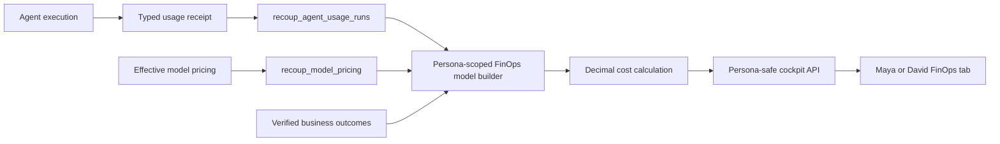

# Maya and David Agent Cost Engineering Implementation Plan

> **For agentic workers:** REQUIRED SUB-SKILL: Use `superpowers:subagent-driven-development` (recommended) or `superpowers:executing-plans` to implement this plan task-by-task. Steps use checkbox (`- [ ]`) syntax for tracking.

**Goal:** Extend Recoup's existing Evals + FinOps capability into a shared, persona-scoped Agent Cost Engineering tab for Maya and David that calculates every cost from the actual model, typed token usage, effective pricing, and verified business outcomes.

**Architecture:** Reuse the existing Supabase-backed FinOps repository, usage receipts, pricing table, rollups, recommendations, and cockpit model. The server authenticates the persona, filters permitted agents and workflows before aggregation, matches each usage receipt to the effective price for its model and service tier, calculates money with `Decimal`, and returns one shared persona-safe cockpit model. React formats backend values but performs no pricing or cost arithmetic.

**Tech Stack:** Node 22, TypeScript, Express cockpit API, Next.js App Router, React, Supabase/Postgres, `decimal.js`, Vitest, Playwright, existing Recoup semantic tokens and Phosphor icons.

---

## 1. Scope and success check

### Maya

- Route: `/forensics/finops`
- Initial agent scope: Forensics Investigator, Recovery Drafter, and Maya query agents for which typed receipts exist.
- Outcome metrics: cost per investigated case, cost per cited answer, and cost per approved recovery draft.

### David

- Route: `/credit/finops`
- Initial agent scope: Credit Sentinel, Risk Mesh, Behavioural Containment, Action Packet Drafter, and David credit-query agents for which typed receipts exist.
- Outcome metrics: cost per account assessed, cost per completed arbitration, and cost per approved term or hold proposal.

### Success check

- Maya cannot receive David receipts, and David cannot receive Maya receipts.
- Every displayed cost can be reproduced from a typed usage receipt and an effective pricing row.
- Missing pricing, usage, or outcome denominators render an explicit unavailable state rather than zero.
- The existing CFO `/governance/evals-finops` surface remains functional.
- `npm run verify` passes.
- Browser verification passes for both personas at desktop and narrow widths.
- Every scored content module achieves at least `4.9/5` against the approved mockup; the sidebar is excluded.

## 2. Branch and source-of-truth gate

The planning snapshot found:

- Inspected worktree branch: `codex/maya-reference-prod-release`
- Inspected worktree SHA: `610f03ec12d072870408bcbcb390fb95d29fb039`
- Local `main` at inspection: `83c6e2249ee517a17b733768fb4c6aa32218d6b0`
- Locally known `origin/main` at inspection: `3915efd4d709b225bbfa9dd1f41e1f46d299e0f1`

Before implementation:

- [ ] Fetch remote refs without modifying application files.
- [ ] Record current `origin/main`, production deployment branch, and deployed commit.
- [ ] Create a clean worktree from the confirmed target main commit.
- [ ] Record the clean worktree path, branch, and SHA in the implementation handoff.
- [ ] Stop if the intended target differs from the checked-out source.

## 3. Existing implementation to reuse

### Live data-readiness gate

Before a workflow appears as cost-ready, require at least one source-backed run with non-zero total tokens, cited record IDs, deterministic basis, and exactly one effective price for its observed model. Cache, reasoning, latency, handoff, tool-call, and guardrail fields may truthfully be zero or unavailable; never manufacture non-zero values. If a multi-agent SDK run exposes only aggregate usage, label and cost it at workflow level rather than falsely assigning the total to individual subagents. David business-outcome economics remain unavailable until the owner ratifies exact source-backed denominators.

Do not create a second FinOps stack. Reuse and extend:

- `src/services/evalsFinopsTypes.ts`
- `src/services/evalsFinopsRepository.ts`
- `src/services/evalsFinopsModel.ts`
- `src/services/evalsFinopsRollups.ts`
- `src/services/evalsFinopsRecommendations.ts`
- `src/services/openAiUsageReceipt.ts`
- `src/services/cockpitApi.ts`
- `cockpit/app/governance/evals-finops/page.tsx`
- `cockpit/app/governance/evals-finops/evals-finops-surface.tsx`
- `cockpit/app/cockpit-data.ts`
- `cockpit/app/cockpit-shell.tsx`
- `config/cockpitDemoProfiles.ts`

Reuse these existing tables:

- `recoup_agent_usage_runs`
- `recoup_model_pricing`
- `recoup_openai_cost_buckets`
- `recoup_finops_daily_rollups`
- `recoup_finops_recommendations`

The planning-time live read found zero active rows in `recoup_model_pricing`. Recheck this at implementation time. Do not add another pricing table unless the existing schema proves unable to represent an effective-dated provider price.

## 4. Pricing contract

The inspected main configuration pins:

- `gpt-5.4`
- `gpt-5.4-mini`
- `gpt-5.4-nano`
- `gpt-realtime-2`
- `gpt-4o-mini-transcribe`

For each model and service tier used by a recorded execution, the pricing record must contain:

- Model ID
- Service tier
- Input price per one million tokens
- Cached-input price per one million tokens
- Output price per one million tokens
- Reasoning-token price per one million tokens
- Currency
- Effective-from timestamp
- Optional effective-to timestamp
- Provider source URL
- Source retrieval timestamp
- Pricing hash
- Human approval identity
- Active status

At plan creation, verified standard API list pricing for `gpt-5.4` was:

| Token type | USD per 1M tokens |
| --- | ---: |
| Input | 2.50 |
| Cached input | 0.25 |
| Output | 15.00 |
| Reasoning | 15.00 |

Source: <https://openai.com/index/introducing-gpt-5-4/>.

These rates are a dated planning reference, not a timeless constant. Re-verify the official provider source at execution time, persist the effective timestamp and pricing hash, and require a human approval identity before activating the row.

Do not scrape prices during every dashboard request. Preserve historical pricing rows so historical usage is calculated with the price effective when the run occurred.

## 5. Deterministic cost formulas

Use `Decimal` for every intermediate and final monetary value.

```text
uncached_input_tokens = input_tokens - cached_input_tokens

input_cost =
  uncached_input_tokens * input_price_per_1m / 1,000,000

cached_input_cost =
  cached_input_tokens * cached_input_price_per_1m / 1,000,000

output_cost =
  output_tokens * output_price_per_1m / 1,000,000

reasoning_cost =
  reasoning_tokens * reasoning_price_per_1m / 1,000,000

total_run_cost =
  input_cost + cached_input_cost + output_cost + reasoning_cost

cache_savings =
  cached_input_tokens
  * (input_price_per_1m - cached_input_price_per_1m)
  / 1,000,000
```

Aggregate formulas:

```text
average_cost_per_run = total_attributable_cost / run_count

cost_per_successful_run =
  total_cost_for_successful_runs / successful_run_count

cost_per_verified_outcome =
  attributable_agent_cost / verified_outcome_count
```

Outcome denominators must come from backend business records. The model and React must not infer or invent them.

## 6. Server-side data flow



The server must:

1. Authenticate the session.
2. Resolve the canonical role as `maya` or `david`.
3. Select only the permitted workflow and agent identifiers.
4. Load typed usage receipts for the requested period.
5. Match each receipt by model ID, service tier, and execution timestamp to one effective pricing row.
6. Calculate per-run costs and cache savings with `Decimal`.
7. Join verified business denominators.
8. Attach record IDs, pricing IDs, timestamps, and deterministic basis.
9. Return only the persona-safe model.

The browser must never receive unrestricted receipts and filter them locally.

## 7. Canonical persona scope

Add a server-owned mapping using canonical runtime identifiers. The exact identifiers must be confirmed against persisted receipts before implementation.

```typescript
const personaFinopsScopes = {
  maya: {
    workflows: [
      "maya_forensics_query",
      "deduction_forensics",
      "recovery_drafting"
    ],
    agents: [
      "Forensics Investigator",
      "Recovery Drafter"
    ]
  },
  david: {
    workflows: [
      "credit_risk",
      "risk_mesh_arbitration",
      "containment"
    ],
    agents: [
      "Credit Sentinel",
      "Risk Mesh",
      "Behavioural Containment",
      "Action Packet Drafter"
    ]
  }
} as const;
```

Do not use substring matching on display names as an authorization boundary.

## 8. Proposed persona cockpit contract

Extend the existing FinOps types rather than duplicating them.

```typescript
interface PersonaFinopsCockpitModel {
  surface: "persona-finops";
  persona: "maya" | "david";
  generatedAtIso: string;
  period: {
    from: string;
    to: string;
  };
  pricing: PricingBasis[];
  summary: PersonaFinopsSummary;
  agentMetrics: AgentCostMetric[];
  tokenComposition: TokenComposition;
  dailyTrend: DailyCostTrend[];
  unitEconomics: UnitEconomicMetric[];
  recommendations: FinopsRecommendation[];
  blockedInputs: BlockedInput[];
  provenance: FinopsProvenance;
}

interface AgentCostMetric {
  agentName: string;
  workflowName: string;
  modelId: string;
  runCount: number;
  succeededCount: number;
  blockedCount: number;
  failedCount: number;
  inputTokens: number;
  cachedInputTokens: number;
  uncachedInputTokens: number;
  outputTokens: number;
  reasoningTokens: number;
  totalTokens: number;
  calculatedCost?: string;
  currency?: string;
  costStatus:
    | "calculated_from_effective_pricing"
    | "reconciled_from_provider_cost"
    | "pricing_unavailable";
  cacheSavings?: string;
  averageCostPerRun?: string;
  latencyP95Ms?: number;
  toolCallsPerRun: string;
  handoffsPerRun: string;
  evidenceHitRate: string;
  guardrailTripCount: number;
  deterministicBasis: string;
  recordIds: string[];
}
```

## 9. UI contract

Visual reference:

- `mockups/imagegen/persona-finops/cost-engineering-calculation-v3.png`

### Header

- Page title
- Authenticated persona
- Period selector
- Pricing verification timestamp
- Source freshness

### Summary

- Runs
- Tokens per run
- Cost per verified outcome
- Cache-hit rate
- p95 latency

### Pricing and calculation

- Model
- Input price
- Cached-input price
- Output price
- Reasoning price
- Effective period
- Provider source
- Calculation formula
- Calculation status

### Agent scorecard

- Agent
- Model
- Workflow
- Runs
- Success rate
- Uncached input tokens
- Cached input tokens
- Output and reasoning tokens
- Tokens per run
- Calculated cost per run
- Tool calls
- Evidence-hit rate
- Cost status
- Human-review rate

### Token and cache composition

- Uncached input
- Cached input
- Output
- Reasoning
- Cache-hit trend
- Proven cache savings

### Optimization actions

- Review cache prefix
- Investigate token spike
- Reduce unnecessary reasoning tokens
- Consider owner-approved model routing
- Resolve missing pricing
- Investigate high guardrail retry cost

Every recommendation must cite affected usage receipts. The page must not apply pricing, budgets, routing changes, or other actions.

## 10. Fail-closed behavior

| Condition | Required UI behavior |
| --- | --- |
| Missing pricing | `Pricing unavailable`; never `$0` |
| Unknown model | `No effective pricing for model` |
| Missing token breakdown | `Usage unavailable`; do not estimate |
| Missing outcome denominator | `Requires verified outcomes` |
| Stale source | Show source timestamp and stale state |
| No persona receipts | `No source-backed agent usage recorded` |
| Provider cost mismatch | Show reconciliation variance |
| Pricing period mismatch | Block calculation |
| Empty record IDs | Suppress the metric |

## 11. Implementation tasks

### Task 1: Confirm current contracts and persisted identifiers

**Files:**

- Inspect: `Recoup_v2_SDD.md` §§7.3, 8.1, 8.2, 10, and 11
- Inspect: `INVARIANTS.md`
- Inspect: `config/models.ts`
- Inspect: `src/types/entities.ts`
- Inspect: `src/services/evalsFinopsTypes.ts`
- Inspect: `src/services/evalsFinopsRepository.ts`

- [ ] Query distinct `agent_name`, `workflow_name`, `model_id`, `model_execution_mode`, and service tier values from bounded live usage rows.
- [ ] Record only identifiers, counts, timestamps, and statuses; do not expose customer payloads.
- [ ] Confirm the canonical Maya and David scope with the owner.
- [ ] Confirm source records for Maya and David business denominators.
- [ ] Stop and request the exact missing mapping if a denominator or agent ownership rule remains open.

### Task 2: Add failing persona-authorization tests

**Files:**

- Modify: `tests/invariants/cockpit-role-auth.test.ts`
- Modify: `tests/unit/cockpit-demo-auth.test.ts`
- Modify: `tests/invariants/cockpit-route-architecture.test.ts`

- [ ] Prove Maya may access `/forensics/finops`.
- [ ] Prove David may access `/credit/finops`.
- [ ] Prove Maya cannot access David FinOps.
- [ ] Prove David cannot access Maya FinOps.
- [ ] Prove CFO governance access remains unchanged.
- [ ] Run the focused tests and confirm they fail before implementation.

### Task 3: Implement canonical persona scope

**Files:**

- Create: `config/personaFinopsScopes.ts`
- Modify: `config/cockpitDemoProfiles.ts`
- Test: `tests/unit/persona-finops-scopes.test.ts`

- [ ] Define exact workflow and agent identifiers approved in Task 1.
- [ ] Add a lookup that rejects unknown roles and identifiers.
- [ ] Add tests for exact inclusion and cross-persona exclusion.
- [ ] Run focused tests and confirm they pass.

### Task 4: Add failing effective-pricing tests

**Files:**

- Modify: `tests/unit/evals-finops-repository.test.ts`
- Modify: `tests/unit/evals-finops-model.test.ts`

- [ ] Test exact model matching.
- [ ] Test service-tier matching.
- [ ] Test effective-from and effective-to boundaries.
- [ ] Test missing pricing returns unavailable.
- [ ] Test overlapping active price periods fail closed.
- [ ] Test historical usage retains historical price selection.
- [ ] Run focused tests and confirm they fail before implementation.

### Task 5: Populate governed effective pricing

**Files:**

- Modify only if required by current schema: `docs/supabase-memory-schema.sql`
- Modify: `src/services/evalsFinopsRepository.ts`
- Modify: `src/services/evalsFinopsTypes.ts`

- [ ] Re-verify official provider pricing for every model present in live receipts.
- [ ] Prepare effective-dated rows with provider URL, retrieval timestamp, approval identity, and pricing hash.
- [ ] Obtain explicit human approval before any live Supabase DML.
- [ ] Insert or activate pricing through an approved migration or bounded DML path.
- [ ] Read the rows back and verify model IDs, rates, dates, currency, hashes, and active state.
- [ ] Never print credentials or secret-bearing responses.

### Task 6: Add failing Decimal cost-calculation tests

**Files:**

- Create: `tests/unit/agent-cost-calculator.test.ts`

- [ ] Test uncached-input cost.
- [ ] Test cached-input cost.
- [ ] Test output cost.
- [ ] Test reasoning cost.
- [ ] Test total run cost.
- [ ] Test cache savings.
- [ ] Test zero-token run.
- [ ] Test missing price.
- [ ] Test invalid token counts.
- [ ] Test effective-date boundaries.
- [ ] Test that monetary outputs are fixed-precision strings.
- [ ] Run the focused test and confirm it fails before implementation.

### Task 7: Extend the existing Decimal cost calculation

**Files:**

- Modify: `src/services/evalsFinopsModel.ts`
- Modify: `src/services/evalsFinopsRollups.ts`
- Test: `tests/unit/agent-cost-calculator.test.ts`

- [ ] Add characterization tests around the existing cost and cache-savings calculations before changing them.
- [ ] Validate inputs with the existing typed boundary pattern.
- [ ] Extend the existing `Decimal` calculations rather than creating a parallel calculator.
- [ ] Return component costs, total cost, cache savings, pricing ID, deterministic basis, and record IDs.
- [ ] Return a typed unavailable result when pricing is missing or ambiguous.
- [ ] Run focused tests and confirm they pass.
- [ ] Run `npm run lint && npm run typecheck && npm run test`.

### Task 8: Complete typed usage capture

**Files:**

- Modify only the confirmed runtime receipt paths in `src/services/cockpitApi.ts` and the relevant Maya/David query services.
- Modify: `tests/unit/openai-prompt-cache.test.ts`
- Modify or create focused receipt tests for David credit execution.

- [ ] Audit Maya live query, recovery drafting, David credit query, Sentinel, Risk Mesh, Containment, and Action Packet Drafter.
- [ ] Persist model ID, token categories, execution status, latency, tool calls, handoffs, guardrails, record IDs, correlation ID, and prompt-cache metadata.
- [ ] Do not synthesize missing provider usage.
- [ ] Prove blocked and failed executions retain status without fabricated token counts.
- [ ] Run focused tests and the standard gates.

### Task 9: Add failing persona-model tests

**Files:**

- Modify: `tests/unit/evals-finops-model.test.ts`
- Modify: `tests/unit/evals-finops-rollups.test.ts`
- Modify: `tests/unit/evals-finops-recommendations.test.ts`

- [ ] Test Maya-only aggregation.
- [ ] Test David-only aggregation.
- [ ] Test cross-persona isolation.
- [ ] Test cost per run and per successful run.
- [ ] Test cache savings.
- [ ] Test missing outcome denominator.
- [ ] Test pricing and usage provenance.
- [ ] Test recommendations cite affected receipt IDs.
- [ ] Run focused tests and confirm they fail before implementation.

### Task 10: Build the persona-scoped model

**Files:**

- Modify: `src/services/evalsFinopsTypes.ts`
- Modify: `src/services/evalsFinopsModel.ts`
- Modify: `src/services/evalsFinopsRollups.ts`
- Modify: `src/services/evalsFinopsRecommendations.ts`

- [ ] Filter by authenticated persona before aggregation.
- [ ] Join each receipt to the effective pricing row.
- [ ] Use the cost calculator for per-run and aggregate totals.
- [ ] Join only verified outcome denominators.
- [ ] Populate explicit blocked inputs for missing pricing, usage, or denominators.
- [ ] Preserve deterministic basis and record IDs at every display level.
- [ ] Run focused tests and the standard gates.

### Task 11: Expose protected persona API reads

**Files:**

- Modify: `src/services/cockpitApi.ts`
- Modify: `cockpit/app/cockpit-data.ts`
- Modify: `tests/unit/cockpit-api.test.ts`
- Modify: `tests/unit/cockpit-data.test.ts`

- [ ] Add a protected persona FinOps read boundary.
- [ ] Derive persona scope from verified server auth, never from a client-controlled query value.
- [ ] Reject mismatched or unknown roles.
- [ ] Return fail-closed `503` responses when required sources are unavailable.
- [ ] Prove Maya and David responses exclude the other persona's record IDs.
- [ ] Run focused tests and the standard gates.

### Task 12: Add routes and navigation

**Files:**

- Create: `cockpit/app/forensics/finops/page.tsx`
- Create: `cockpit/app/credit/finops/page.tsx`
- Modify: `cockpit/app/cockpit-shell.tsx`
- Modify: `config/cockpitDemoProfiles.ts`
- Modify: route and auth tests named in Tasks 2 and 11.

- [ ] Route-gate the Maya page with `/forensics/finops`.
- [ ] Route-gate the David page with `/credit/finops`.
- [ ] Add one `FinOps` sidebar link to each persona.
- [ ] Keep the CFO governance route and navigation unchanged.
- [ ] Run focused tests and the standard gates.

### Task 13: Build the shared Agent Cost Engineering surface

**Files:**

- Create: `cockpit/components/finops/persona-finops-surface.tsx`
- Create focused child components under `cockpit/components/finops/` only when a component has one clear responsibility.
- Modify: `cockpit/app/styles.css`
- Create: `tests/unit/persona-finops-surface-source.test.ts`

- [ ] Render the shared header and source status.
- [ ] Render summary metrics without computing business values in React.
- [ ] Render the effective pricing basis and formula.
- [ ] Render the agent scorecard with model, token mix, price status, and backend-calculated costs.
- [ ] Render one meaningful token/cache comparison visualization.
- [ ] Render deterministic recommendations and provenance drill-down.
- [ ] Render all fail-closed states explicitly.
- [ ] Use existing semantic tokens and Phosphor icons.
- [ ] Do not use fake budgets, static dollar values, gradients, glassmorphism, decorative ticker, donut gauges, or raw backend enums.
- [ ] Run focused tests and the standard gates.

### Task 14: Browser and visual verification

**Files:**

- Modify: `tests/e2e/cockpit-premium-e2e.ts`
- Add focused E2E coverage only if the existing suite cannot express the persona routes.
- Evidence output: existing approved QA evidence location.

- [ ] Test Maya login and `/forensics/finops`.
- [ ] Test David login and `/credit/finops`.
- [ ] Test cross-persona URL denial.
- [ ] Test successful cost calculation.
- [ ] Test missing pricing.
- [ ] Test missing outcome denominator.
- [ ] Test empty, stale, and unavailable usage states.
- [ ] Test provenance drill-down.
- [ ] Test 1440px desktop and a narrow viewport.
- [ ] Prove no page-level horizontal overflow.
- [ ] Compare screenshots with `mockups/imagegen/persona-finops/cost-engineering-calculation-v3.png`.
- [ ] Score header/filter, KPI strip, pricing/formula, agent scorecard, token/cache composition, optimization/provenance, and empty/error states separately.
- [ ] Require every scored content module to achieve at least `4.9/5`; do not average away a weak module.
- [ ] Exclude the left sidebar from visual scoring as explicitly approved by the owner.

### Task 15: Final verification and critique

- [ ] Run `npm run lint`.
- [ ] Run `npm run typecheck`.
- [ ] Run `npm run test`.
- [ ] Run `npm run verify`.
- [ ] Inspect `git diff` for unrelated lines.
- [ ] Re-read the referenced SDD sections and list every inconsistency between the diff and spec.
- [ ] Explain the likeliest remaining bug and rate confidence.
- [ ] Run a senior-engineer critique over the final diff.
- [ ] Resolve or surface every critique item.
- [ ] Record the branch, worktree, SHA, tested routes, pricing source timestamp, live source mode, and remaining owner inputs.

## 12. Risk assessment

| Risk | Impact | Mitigation |
| --- | --- | --- |
| Wrong branch or stale worktree | Changes do not match current production | Mandatory branch/SHA/deployment proof before edits |
| Cross-persona data leakage | Maya sees David telemetry or vice versa | Filter before aggregation; explicit isolation tests |
| Stale price changes historical cost | Financial reports drift | Effective-dated immutable pricing rows |
| Duplicate or overlapping prices | Ambiguous cost basis | Reject ambiguous matches and fail closed |
| Missing David receipts | Empty or misleading David page | Complete receipt audit; honest unavailable state |
| Reasoning tokens charged incorrectly | Understated cost | Store explicit reasoning price and test calculation |
| React calculates dollars | Violates deterministic spine | Server-only Decimal calculation and invariant test |
| `$0` used for missing data | False financial claim | Typed unavailable states and UI tests |
| Cost per outcome uses inferred counts | Misleading business economics | Verified backend denominators only |
| Static mockup values leak into product | Fake production data | Source tests prohibit hard-coded business values |
| Provider list price treated as reconciled invoice cost | Overclaiming precision | Distinguish list-priced calculation from provider-reconciled cost |
| Optimization actions become autonomous | Governance violation | Read-only recommendations with human approval |

## 13. Definition of done

- Current main-derived clean worktree proven.
- Persona authorization and isolation proven.
- Pricing is effective-dated, sourced, hashed, and human-approved.
- All monetary calculations use `Decimal`.
- Every displayed dollar cites usage receipts and pricing records.
- Missing data fails closed.
- Maya and David routes render the same shared implementation with different server scopes.
- CFO Evals + FinOps remains unchanged and passing.
- Runtime screenshot matches the approved visual direction with all remaining deltas documented.
- Every scored content module is at least `4.9/5`, with the sidebar excluded.
- `npm run verify` is green.
- Senior critique and spec validation have no unresolved inconsistencies.
